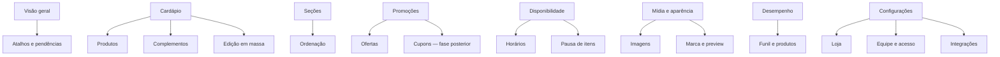

# Análise do painel administrativo do Anota AI

> Referência de arquitetura de informação, UI/UX e requisitos técnicos para o painel administrativo do cardápio digital da Tremeliko's Burguer.

**Data da inspeção:** 2 de setembro de 2026  
**Página observada:** painel autenticado do Anota AI, tela **Meus pedidos**  
**Viewport observado:** 1366 × 577 px, DPR 1  
**Escopo:** estrutura global, navegação, organização operacional, padrões visuais, desempenho percebido e aplicação ao projeto local.  
**Privacidade:** nenhum dado pessoal de cliente ou pedido foi registrado. A fila estava vazia durante a inspeção. Não foram copiadas credenciais, identificadores internos nem dados comerciais sensíveis.

---

## 1. Conclusão executiva

A estrutura do Anota AI é uma boa referência para **velocidade operacional**, mas não para ser copiada integralmente. Seus melhores padrões são:

- navegação persistente;
- estado operacional sempre visível;
- busca próxima da tarefa;
- ação primária evidente;
- estados e contadores fáceis de reconhecer;
- listas virtualizadas para preservar performance;
- configurações rápidas dentro do contexto de uso;
- edição em massa e divisão entre operação, crescimento, análises e configurações.

O principal problema é o excesso de escopo. Foram identificados **26 destinos de primeiro nível**, além de dezenas de subitens, módulos promocionais e conceitos repetidos. Isso faz sentido em uma plataforma completa de restaurante, com PDV, salão, cozinha, entregadores, robô e pagamentos, mas é excessivo para o painel do cardápio da Tremeliko's.

### Recomendação

Construir um painel próprio, inspirado nos padrões operacionais validados, com no máximo **7 a 9 destinos principais**:

1. Visão geral
2. Cardápio
3. Seções
4. Promoções
5. Disponibilidade
6. Mídia e aparência
7. Desempenho
8. Configurações

Adicionar **Pedidos** somente se o pedido passar a ser processado dentro da aplicação. Enquanto o fechamento ocorrer por WhatsApp, não vale reproduzir Kanban, KDS, PDV, entregadores ou gestão de salão.

### Viabilidade

É totalmente viável construir essa ferramenta com **Next.js + Supabase + Vercel**. O projeto atual já possui rotas iniciais para produtos, seções, promoções e configurações. Antes de colocá-lo em produção, porém, é obrigatório concluir autenticação, autorização e proteção das operações administrativas.

---

## 2. Estrutura visual observada

```text
┌────────────── 220 px ──────────────┬──────────────── cabeçalho global, 60 px ────────────────┐
│ logo e busca                       │ marca/promos  │ estado operacional │ alertas │ perfil   │
├────────────────────────────────────┼───────────────────────────────────────────────────────────┤
│                                    │ filtros + busca + ação primária                          │
│ navegação lateral                  ├───────────────────────────────────────────────────────────┤
│ fixa e rolável                     │                                                           │
│                                    │ conteúdo operacional / Kanban                            │
│                                    │                                                           │
│ grupos e submenus                  │                                                           │
│                                    │                                                 utilitários│
│                                    │                                                           │
└────────────────────────────────────┴───────────────────────────────────────────────────────────┘
```

### Medidas e comportamento

| Área | Medida observada | Comportamento |
|---|---:|---|
| Barra lateral | 220 px | Fixa, azul-escura, conteúdo interno rolável |
| Cabeçalho global | 60 px | Fixo no topo da área útil |
| Conteúdo principal | 1146 px no viewport observado | Fundo neutro e rolagem própria |
| Padding do conteúdo | 32 px lateral e superior | Boa separação do shell |
| Área útil interna | 1082 px | Abriga filtros, busca e painel operacional |
| Barra de utilitários à direita | aproximadamente 46 px | Ícones e contadores compactos |
| Linha de filtros | 42 px | Filtros, busca, ação primária e configurações |
| Cabeçalho das colunas | 40 px | Título, contador e ação contextual |

### Tokens visuais capturados

| Token | Valor observado | Aplicação recomendada |
|---|---|---|
| Fonte | Roboto / Helvetica Neue / sans-serif | Usar fonte utilitária legível no admin |
| Sidebar | `#003E63` | Não copiar a cor; manter o padrão de contraste |
| Item ativo | `#0098FC` | Trocar pela cor de marca da Tremeliko's |
| Fundo da aplicação | `#F6F7F8` | Boa base neutra para o admin |
| Busca — borda | `#99D7FF` | Aplicar somente no foco ou estado ativo |
| Ícones inativos | `#9CB3C1` | Usar com contraste AA comprovado |
| Em análise | cabeçalho `#7A7A7A`, corpo `#C4C4C4` | Preferir tintas claras no corpo |
| Em produção | cabeçalho `#DF9403`, corpo `#FFA800` | Reservar cor forte a badges/cabeçalhos |
| Pronto | cabeçalho `#4D8147`, corpo `#4BAD6D` | Reforçar com texto/ícone, não só cor |
| Raio dos controles | 4–8 px | Padronizar em escala, sem valores casuais |

O painel observado utiliza controles com 35–40 px de altura. Para a nova ferramenta, o alvo deve ser **44 px ou maior**, especialmente para uso em tablets e celulares.

---

## 3. Organização da tela “Meus pedidos”

A tela segue uma hierarquia eficiente:

1. filtros por origem/tipo do pedido;
2. busca por cliente ou número;
3. ação principal **Novo pedido**;
4. configuração contextual;
5. Kanban com contagem por estado;
6. mensagens vazias específicas para cada estado;
7. ações de operação incorporadas à coluna relevante.

### Estados observados

- **Em análise**
- **Em produção**
- **Prontos para entrega**

Na primeira coluna aparecem também:

- tempo estimado de balcão;
- tempo estimado de delivery;
- ação de edição;
- alternância para aceitar pedidos automaticamente.

A terceira coluna contém a ação **Finalizar**, desabilitada quando não há pedidos. Isso reduz cliques inválidos e deixa a próxima ação perto do objeto afetado.

### Padrão de performance importante

Cada coluna usa uma viewport de rolagem virtual (`cdk-virtual-scroll-viewport`). Isso evita renderizar todos os pedidos ao mesmo tempo e é um padrão que deve ser reutilizado em listas extensas de produtos, clientes ou pedidos.

### O que importar desse fluxo

- ação primária única por tela;
- filtros e busca na mesma faixa;
- contagem sempre junto ao estado;
- configuração rápida no contexto;
- estado vazio que explica o próximo passo;
- botão desabilitado quando a ação não é válida;
- virtualização quando a lista crescer;
- feedback visual imediato depois de uma alteração.

### O que melhorar

- filtros que usam apenas ícones precisam de rótulo acessível e tooltip;
- cores de status precisam ser acompanhadas de texto ou ícone;
- grandes fundos saturados cansam visualmente e prejudicam contraste;
- falta um título de página ou breadcrumb mais explícito;
- o cabeçalho global concentra informação demais;
- ações com engrenagem sem rótulo aumentam ambiguidade.

---

## 4. Inventário da navegação observada

### Seu dia a dia

- Meus pedidos
- Pedidos balcão (PDV)
- Pedidos salão
- Pedidos agendados
- Gestor de cardápio
  - Gestor
  - Imagens do cardápio
  - Edição em massa
  - Potencializador de cardápio
- Entregas
  - Cadastro entregadores
  - Relatório entregadores
  - Áreas de entrega
- Meu Desempenho
- Cozinha — KDS
- Pagamento online
- Robô
  - Chamado atendentes
  - Feedback de clientes
  - Personalização
  - Configurações

### Meu Salão

- Gestão de salão
- Configurações Salão
  - Meu Salão
  - Meus Garçons
  - App Garçom
  - Comandas
  - Pedidos Balcão (PDV)
  - Taxa de serviço
  - Cardápio QR Code
  - Impressoras
  - Balanças

### Venda mais

- Recuperador de vendas
- Cashback
- Cupom
- Central de Crescimento
- Compre + Ganhe +

### Análises

- Relatórios
  - Geral
  - Caixas
  - Clientes
  - Entradas
  - Pedidos
  - Funil de conversão
  - Mesas e comandas
  - Cupons
  - Itens
  - Entregadores
  - Garçons
  - Área de Entrega
  - Satisfação
  - Cashback
- Satisfação

### Configurações

- Entregadores
  - Cadastro
  - Relatórios
  - Configurações
- Minha conta
  - Geral
  - Informações pessoais
  - Formas de pagamento
  - Fatura
  - Planos
  - Colaboradores
- Configurações
  - Meus Clientes
  - Meus Pedidos
  - Impressora
  - Frente de caixa
  - Integrações
  - Cardápio Digital
  - Redes Sociais
  - Entregadores
  - Robô
  - Estabelecimento
  - Pedidos agendados

### Vantagens e suporte

- Benefícios
  - Parceiros
  - Indique e Ganhe
- Instruções de ajuda
- Sugestões
- Termos e Políticas

### Diagnóstico da arquitetura de informação

**Pontos fortes**

- agrupamento por contexto de negócio;
- tarefas diárias aparecem antes das configurações;
- estado da loja permanece acessível;
- recursos complexos são recolhidos em submenus;
- suporte fica disponível dentro do produto.

**Pontos de atrito**

- o menu é longo e exige rolagem;
- promoções de produtos da plataforma competem com tarefas operacionais;
- Entregadores, Relatórios, Satisfação, Configurações e PDV aparecem em mais de um lugar;
- rótulos como “Geral” dependem do contexto do submenu;
- recursos de alta frequência e baixa frequência convivem no mesmo nível;
- vários submenus podem permanecer abertos, tornando o menu ainda mais extenso.

---

## 5. Arquitetura recomendada para a Tremeliko's



### Regra central

Organizar o painel pela pergunta do operador, não pelo desenho do banco:

- “O que está publicado?” → Visão geral
- “Preciso alterar um lanche” → Cardápio
- “Quero mudar a ordem” → Seções
- “Quero vender mais hoje” → Promoções
- “Acabou um item” → Disponibilidade
- “Quero trocar fotos ou identidade” → Mídia e aparência
- “O que converte mais?” → Desempenho
- “Onde altero dados da loja?” → Configurações

### Sidebar recomendada

- largura entre 224 e 240 px no desktop;
- apenas um submenu aberto por vez;
- item ativo com fundo e indicador lateral;
- opção de recolher para 64–72 px;
- loja e usuário no rodapé;
- link **Ver cardápio** e status **Publicado/Rascunho** no cabeçalho;
- promoções comerciais nunca devem ocupar a navegação de trabalho.

---

## 6. Especificação das telas

### 6.1 Visão geral

Exibir somente informação acionável:

- status do cardápio: publicado, rascunho ou alterações pendentes;
- produtos ativos, indisponíveis e sem imagem;
- promoções ativas e próximas de expirar;
- atalhos para adicionar produto, pausar item e criar promoção;
- preview do cardápio em nova aba;
- últimos eventos administrativos;
- alertas de qualidade: preço ausente, seção vazia, imagem pesada, promoção inconsistente.

Evitar métricas decorativas. Cada card deve levar a uma ação ou detalhe.

### 6.2 Cardápio / Produtos

Barra superior:

- busca por nome;
- filtros por seção, status, destaque e disponibilidade;
- ordenação;
- botão **Novo produto**;
- acesso a **Edição em massa**.

Lista:

- miniatura otimizada;
- nome e seção;
- preço atual e preço promocional;
- disponibilidade;
- destaque;
- estado publicado/rascunho;
- menu de ações.

Ações rápidas:

- pausar/reativar sem abrir formulário;
- duplicar produto;
- alterar preço;
- mover para outra seção;
- pré-visualizar;
- arquivar com confirmação e possibilidade de desfazer.

Em celular, substituir tabela por cards compactos. Não obrigar rolagem horizontal.

### 6.3 Editor de produto

Usar formulário em uma página ou drawer largo, dividido por blocos:

1. informações essenciais: nome, descrição, preço e imagem;
2. organização: seção, posição, destaque e badge;
3. disponibilidade: ativo, pausado e agendamento;
4. complementos e variações;
5. SEO/compartilhamento, recolhido como conteúdo avançado;
6. preview mobile ao lado no desktop.

Ter barra de ações fixa com **Salvar rascunho**, **Publicar** e indicação de alterações não salvas.

### 6.4 Seções

- lista ordenável por arrastar e soltar;
- alternativa acessível “Mover para cima/baixo”;
- quantidade de produtos por seção;
- ativar/desativar;
- edição inline de nome;
- alerta antes de desativar seção com produtos ativos;
- preview imediato da ordem no cardápio.

### 6.5 Promoções

Cada promoção deve mostrar:

- nome interno e texto exibido;
- tipo: percentual, valor fixo, preço promocional ou combo;
- produtos/seções elegíveis;
- início e fim;
- dias da semana e faixa de horário;
- prioridade e possibilidade de acumular;
- limite de uso, quando aplicável;
- estado: rascunho, agendada, ativa, encerrada ou pausada;
- estimativa/previsão do preço final antes de publicar.

O sistema deve impedir ou alertar conflitos: promoções sobrepostas, preço negativo, fim anterior ao início e item indisponível.

### 6.6 Disponibilidade

Esta tela deve ser extremamente rápida:

- abrir/fechar cardápio manualmente;
- exibir horários regulares;
- cadastrar exceções e feriados;
- pausar múltiplos produtos;
- agendar retorno de item;
- mostrar quando e por quem o status foi alterado.

### 6.7 Mídia e aparência

- biblioteca de imagens com uso e tamanho;
- recorte 1:1 e preview de produto;
- alerta para imagem de baixa resolução ou arquivo pesado;
- logo, capa, cores e textos institucionais;
- preview responsivo do cardápio;
- nunca permitir que uma alteração visual quebre contraste mínimo.

### 6.8 Desempenho

MVP recomendado:

- sessões e usuários;
- visualização de produto;
- abertura de produto;
- adição ao carrinho;
- início de checkout;
- clique para concluir no WhatsApp;
- conversão por origem/campanha;
- produtos e seções com melhor conversão;
- funil com comparação de período.

Não coletar mais dados do que o necessário. Respeitar consentimento e LGPD.

### 6.9 Configurações

Separar por abas ou navegação local:

- Loja
- Pedido e atendimento
- Horários
- Equipe e permissões
- Integrações
- Auditoria

Dados sensíveis e permissões devem ficar longe de configurações cotidianas.

---

## 7. Design system recomendado

### Princípios

- grade base de 8 px;
- contraste WCAG AA;
- alvos de toque a partir de 44 × 44 px;
- foco de teclado sempre visível;
- texto e ícone acompanhando estados semânticos;
- uma ação primária por região;
- densidade confortável por padrão e compacta como opção;
- brand orange da Tremeliko's em chamadas primárias, não em grandes superfícies.

### Escalas iniciais

```css
--space-1: 4px;
--space-2: 8px;
--space-3: 12px;
--space-4: 16px;
--space-5: 24px;
--space-6: 32px;
--space-7: 48px;

--radius-sm: 6px;
--radius-md: 10px;
--radius-lg: 14px;

--control-sm: 36px;
--control-md: 44px;
--control-lg: 52px;

--surface-app: #F6F7F8;
--surface-card: #FFFFFF;
--text-primary: #171717;
--text-secondary: #5F6368;
--border-default: #E5E7EB;
```

As cores de marca devem ser ligadas a tokens semânticos (`primary`, `on-primary`, `focus`) após teste de contraste. Não acoplar componentes diretamente a nomes como `orange-500`.

### Hierarquia de componentes

**Átomos**

- Button, IconButton, Input, Select, Checkbox, Switch, Badge, Avatar, Tooltip, Skeleton.

**Moléculas**

- SearchField, FilterChip, StatusControl, PriceField, ImageUploader, EmptyState, ConfirmDialog, Toast.

**Organismos**

- AppSidebar, AdminHeader, DataToolbar, ProductTable, ProductForm, PromotionBuilder, PublishBar, MobileProductList.

**Templates**

- ListPage, EditorPage, SettingsPage, AnalyticsPage e DashboardPage.

Todos os componentes devem possuir estados de loading, vazio, erro, desabilitado, foco, sucesso e permissão insuficiente.

---

## 8. Interações que tornam o painel ágil

- busca global ou paleta de comandos (`Ctrl/Cmd + K`);
- filtros persistidos na URL;
- salvamento automático apenas de rascunhos;
- publicação explícita e auditável;
- atualização otimista somente para ações reversíveis;
- toast com **Desfazer** em pausa, reordenação e arquivamento;
- edição inline de preço e disponibilidade;
- operações em lote;
- atalhos de teclado documentados;
- skeleton durante carregamento, sem saltos de layout;
- mensagens de erro que explicam correção;
- prevenção contra perda de formulário não salvo;
- preview do resultado antes da publicação.

### Modelo de publicação recomendado

```text
Editar → validar → salvar rascunho → revisar preview → publicar → revalidar cardápio
```

Separar rascunho de conteúdo publicado evita que edições incompletas apareçam para clientes e permite revisão segura.

---

## 9. Arquitetura técnica e performance

### Frontend

- Next.js App Router;
- layout persistente para `/admin`;
- Server Components para leitura inicial e componentes cliente apenas onde houver interação;
- formulários com Server Actions ou Route Handlers validados;
- importação dinâmica de editores, gráficos e uploaders pesados;
- paginação e filtros no servidor;
- debounce de 250–400 ms na busca;
- virtualização quando uma lista exceder aproximadamente 100 itens;
- miniaturas responsivas em vez das imagens originais;
- estados de carregamento por rota e por bloco.

### Supabase

- autenticação com Supabase Auth;
- RLS em todas as tabelas administrativas;
- perfil administrativo vinculado a `store_id`;
- papéis mínimos: `owner`, `manager` e `editor`;
- índices compostos orientados às consultas reais;
- transação/RPC para edição em massa e publicação;
- Storage com políticas por loja e validação de MIME/tamanho;
- logs de auditoria com ator, entidade, antes/depois e data;
- Realtime somente onde trouxer ganho operacional real.

Índices candidatos, confirmados após medir consultas:

```sql
products (store_id, active, position)
products (store_id, available, updated_at desc)
sections (store_id, active, position)
promotions (store_id, active, starts_at, ends_at)
audit_logs (store_id, created_at desc)
```

### Vercel e cache

- cachear dados públicos do cardápio;
- executar revalidação sob demanda depois da publicação;
- manter o painel autenticado dinâmico;
- não desabilitar cache globalmente no storefront;
- monitorar Web Vitals, erros e tempo das consultas;
- comprimir imagens e gerar formatos modernos;
- evitar pacotes grandes para tarefas simples.

### Orçamento inicial de qualidade

- navegação percebida sem bloqueios longos;
- interação visível em até 100 ms quando local/otimista;
- resposta de mutação com feedback imediato;
- nenhuma imagem original carregada em listagens;
- zero erro de console e zero requisição repetida sem necessidade;
- bundle por rota acompanhado no build;
- consultas críticas observadas e explicadas no plano do Supabase.

---

## 10. Segurança obrigatória

### Estado encontrado no projeto local

O painel existente ainda é um esqueleto e **não está pronto para produção**:

- a tela `/admin/login` contém somente a interface, sem autenticação funcional;
- não foi encontrado middleware protegendo `/admin`;
- páginas administrativas consultam `supabaseAdmin`, que usa a chave `service_role` no servidor;
- as ações administrativas atuais não demonstram verificação de usuário, loja ou papel;
- os botões de alternância em Produtos não estão conectados às Server Actions declaradas;
- formulários e botões de criar/editar/excluir ainda não implementam o fluxo completo.

A chave `service_role` não aparece no navegador pelo simples fato de o módulo ser server-only, mas ela **ignora RLS**. Por isso, uma rota ou Server Action sem autorização explícita cria risco crítico.

### Gate antes de qualquer deploy público

1. implementar login real;
2. proteger todo o segmento `/admin` no servidor;
3. validar usuário com `getUser()`, nunca confiar apenas em estado do cliente;
4. confirmar `admin_profiles.active`, `store_id` e papel em cada mutação;
5. usar cliente autenticado com RLS por padrão;
6. reservar `service_role` para operações internas estritamente controladas;
7. validar payloads com Zod;
8. incluir `store_id` em toda consulta e mutação administrativa;
9. adicionar rate limiting onde houver abuso possível;
10. registrar auditoria de alteração de preço, disponibilidade, promoção e permissões;
11. proteger upload contra tipo, tamanho e nome malicioso;
12. testar acesso horizontal entre lojas, mesmo que inicialmente exista apenas uma.

---

## 11. Responsividade e acessibilidade

### Desktop, a partir de 1024 px

- sidebar persistente;
- filtros em linha;
- tabelas e preview lado a lado;
- largura máxima confortável para formulários.

### Tablet, 768–1023 px

- sidebar recolhida;
- toolbar com quebra controlada;
- drawers em tela ampla;
- ações frequentes ao alcance do toque.

### Mobile, abaixo de 768 px

- navegação em drawer;
- cabeçalho compacto com título e ação principal;
- tabelas transformadas em cards;
- filtros em bottom sheet;
- barra de salvar/publicar fixa;
- nenhum fluxo depende de hover ou clique direito;
- formulários em uma coluna e teclado adequado por campo.

### Checklist WCAG

- navegação completa por teclado;
- ordem de foco previsível;
- labels reais em todos os campos;
- `aria-label` em IconButtons;
- mensagem de erro ligada ao campo;
- contraste AA para texto e controles;
- status não comunicado apenas por cor;
- modal com foco preso e retorno ao gatilho;
- área de toque mínima de 44 px;
- suporte a `prefers-reduced-motion`.

---

## 12. Aplicação à estrutura atual do repositório

Rotas já existentes:

| Rota atual | Papel futuro | Ação recomendada |
|---|---|---|
| `/admin` | Visão geral | Manter, acrescentar shell persistente e informações acionáveis |
| `/admin/login` | Autenticação | Ligar ao Supabase Auth e tratar sessão/erros |
| `/admin/produtos` | Cardápio | Implementar CRUD, filtros, edição em massa e mobile cards |
| `/admin/secoes` | Seções | Implementar ordenação, ativação e validação |
| `/admin/promocoes` | Promoções | Implementar construtor, agenda, conflitos e preview |
| `/admin/configuracoes` | Configurações | Separar em áreas e implementar persistência segura |

Rotas sugeridas para evolução:

```text
/admin/cardapio
/admin/cardapio/novo
/admin/cardapio/[id]
/admin/cardapio/edicao-em-massa
/admin/secoes
/admin/promocoes
/admin/disponibilidade
/admin/midia
/admin/desempenho
/admin/configuracoes/loja
/admin/configuracoes/equipe
/admin/configuracoes/integracoes
/admin/configuracoes/auditoria
```

Produtos pode continuar como URL por compatibilidade, mas **Cardápio** é um rótulo mais alinhado ao modelo mental da operação e permite reunir produtos, complementos e edição em massa.

---

## 13. Sequência de implementação sugerida

### Fase 0 — segurança

- autenticação;
- proteção de rotas;
- papéis e RLS;
- validação de ações;
- auditoria mínima.

### Fase 1 — shell e operação essencial

- layout administrativo persistente;
- dashboard acionável;
- CRUD real de produtos e seções;
- disponibilidade rápida;
- preview e publicação;
- experiência mobile.

### Fase 2 — vendas

- promoções agendadas;
- edição em massa;
- complementos/variações;
- biblioteca de mídia;
- eventos de analytics.

### Fase 3 — otimização

- funil de conversão;
- relatórios de itens;
- sugestões de qualidade;
- testes A/B de apresentação;
- permissões mais granulares.

### Fora do escopo até existir necessidade comprovada

- PDV;
- gestão de salão e garçons;
- KDS;
- gestão de entregadores;
- robô de atendimento;
- pagamentos e faturamento da plataforma;
- módulos de parceiros ou upsell.

---

## 14. Critérios de aceite do MVP administrativo

- [ ] usuário não autenticado nunca acessa `/admin`;
- [ ] usuário só altera dados da loja permitida;
- [ ] todas as mutações são validadas e auditadas;
- [ ] produto pode ser criado, editado, pausado, reordenado e arquivado;
- [ ] seção pode ser criada, ordenada e desativada com proteção de dependências;
- [ ] promoção pode ser agendada, pausada e validada antes da publicação;
- [ ] alterações podem ficar em rascunho e ser pré-visualizadas;
- [ ] publicar revalida o cardápio na Vercel;
- [ ] operações em lote possuem confirmação e feedback;
- [ ] painel funciona sem rolagem horizontal em 360 px;
- [ ] ações principais possuem alvo de toque de pelo menos 44 px;
- [ ] estados de vazio, loading, erro e sem permissão estão implementados;
- [ ] consultas de lista são paginadas e filtradas no servidor;
- [ ] imagens de listagem usam thumbnails otimizadas;
- [ ] métricas essenciais do funil são registradas com consentimento adequado;
- [ ] testes cobrem autenticação, isolamento por loja e regras de promoção.

---

## 15. Decisão final

Usar o Anota AI como **referência de padrões**, não como molde completo:

| Importar | Adaptar | Não importar agora |
|---|---|---|
| sidebar persistente | cores para a marca Tremeliko's | menu com dezenas de módulos |
| busca e filtros contextuais | estados com tintas mais leves | promoções da plataforma no menu |
| ação primária evidente | Kanban somente se houver pedidos internos | PDV, salão, KDS e entregadores |
| contadores e estados vazios | densidade com alvos de 44 px | conceitos duplicados |
| edição em massa | relatórios focados no funil digital | configurações espalhadas |
| virtualização de listas | shell responsivo | fundos saturados extensos |
| feedback e ações no contexto | publicação com rascunho/preview | icon-only sem rótulo |

O resultado ideal é um painel menor, mais seguro e mais rápido que o Anota AI para o trabalho específico da Tremeliko's: **manter o cardápio atualizado, lançar promoções rapidamente e melhorar conversão sem exigir treinamento complexo**.

---

## 16. Limitações desta inspeção

- A análise é uma fotografia inicial da estrutura autenticada e da tela de pedidos.
- Os submenus foram inspecionados sem abrir telas que poderiam conter clientes, faturamento, integrações ou outras informações sensíveis.
- Não foram executadas ações de criação, edição, exclusão ou configuração.
- Detalhes do editor de cardápio, construtor de promoções e relatórios do Anota AI exigiriam uma segunda inspeção específica, novamente sem capturar dados pessoais ou segredos.

