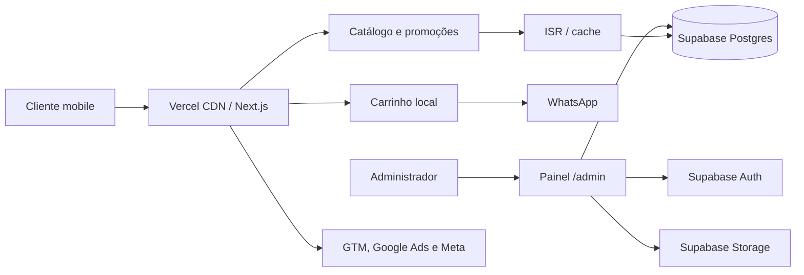

# Viabilidade e especificação do cardápio digital — Tremeliko's Burguer

> Documento de arquitetura e produto para desenvolvimento assistido por IA.  
> Data da análise: 31 de agosto de 2026.  
> Cardápio de referência: <https://pedido.anota.ai/loja/tremelikos-burguer-2>

## 1. Resumo executivo

O projeto é **viável e recomendado**. Um cardápio próprio, otimizado para celular e mensuração de campanhas, pode oferecer uma experiência de conversão melhor do que o cardápio atual e dar à Tremeliko's controle sobre marca, dados, promoções, SEO e eventos de Meta Ads e Google Ads.

### Parecer

| Dimensão | Avaliação | Observação |
|---|---:|---|
| Viabilidade técnica | 9/10 | Next.js, Supabase e Vercel atendem bem ao volume e ao tipo de aplicação. |
| Velocidade de desenvolvimento | 9/10 | Um monólito modular, TypeScript e escopo de MVP permitem desenvolvimento rápido com IA. |
| Segurança | 8/10 | É simples manter o catálogo público e o painel protegido com Auth, RLS e privilégios mínimos. |
| Performance mobile | 9/10 | Server Components, cache/ISR, imagens responsivas e pouco JavaScript são adequados. |
| Potencial de conversão | 8/10 | Depende principalmente de fotos reais, ofertas, combos, copy e mensuração correta. |
| Complexidade operacional | 7/10 | Aumenta muito se o MVP incluir pagamento, entrega e acompanhamento de pedidos nativos. |

### Decisão recomendada

Construir o MVP como um **cardápio de alta conversão com catálogo, promoções, carrinho local e finalização no WhatsApp**. O painel administrativo controla produtos, seções, disponibilidade, adicionais, horários e promoções.

Não construir no primeiro ciclo:

- gateway de pagamento;
- cálculo avançado de entrega por rota;
- rastreamento em tempo real do pedido;
- aplicativo nativo;
- programa de fidelidade;
- motor genérico de promoções do tipo “compre X e leve Y”;
- microserviços.

Esses recursos podem ser adicionados sem refazer o catálogo, desde que o modelo de dados proposto seja seguido.

## 2. Objetivo do produto

Criar um cardápio digital próprio que:

- receba tráfego de Meta Ads e Google Ads;
- carregue rapidamente em conexões móveis;
- apresente ofertas e produtos com forte apelo visual;
- reduza a quantidade de passos até o pedido;
- permita administrar seções, produtos, adicionais, disponibilidade e promoções;
- registre eventos confiáveis para otimização de mídia;
- seja simples de manter e evoluir com desenvolvimento assistido por IA;
- não dependa de deploy para alterar preço, produto, seção ou promoção.

## 3. Premissas adotadas

Como ainda não foi definido um fluxo de pagamento e logística, esta especificação assume:

1. O cliente não precisa criar conta.
2. O carrinho fica no navegador do cliente.
3. A finalização abre o WhatsApp da hamburgueria com uma mensagem estruturada contendo itens, adicionais, quantidades e total estimado.
4. Endereço, taxa, forma de pagamento e confirmação final são tratados pelo atendimento no WhatsApp.
5. O catálogo pode ser visualizado mesmo com a loja fechada.
6. Se a loja estiver fechada, a interface informa o próximo horário e pode permitir montar o carrinho; o envio poderá ser bloqueado ou marcado como pedido futuro, conforme decisão operacional.
7. O painel terá poucos usuários internos e não haverá cadastro público de administradores.
8. O projeto começa atendendo uma unidade, mas todas as principais tabelas terão `store_id` para permitir nova unidade no futuro.

Se a exigência for receber pedidos e pagamentos inteiramente dentro do site, o projeto continua viável, porém deixa de ser um MVP simples. Essa alternativa adiciona integração com gateway, antifraude, webhooks idempotentes, tratamento de falhas, dados pessoais, regras de entrega e uma operação de pedidos.

## 4. Diagnóstico do cardápio atual

### Pontos positivos

- 39 itens com preços definidos;
- descrições razoavelmente completas para os lanches;
- linhas de produtos bem diferenciadas;
- preços competitivos;
- endereço, horários e formas de pagamento informados;
- identidade visual existente;
- boa oferta de produtos autorais.

### Problemas relevantes para conversão

1. **37 dos 39 produtos usam a mesma imagem genérica.** Só as batatas pequena e média possuem fotos próprias.
2. O Cheese Burguer custa R$ 14,99, mas o pedido mínimo é R$ 15,00; ele não pode ser comprado sozinho por uma diferença de R$ 0,01.
3. Não há seções de “Mais pedidos”, “Combos” ou “Promoções”.
4. O cardápio começa por entradas, e não pelos principais produtos ou ofertas.
5. “Linha Gourmet” aparece em duas seções consecutivas.
6. A navegação não evidencia campeões de venda nem oferece uma escolha guiada.
7. Com a loja fechada, a tela do produto não oferece agendamento ou ação alternativa clara.
8. A frase de posicionamento “🔥 Hambúrguer na brasa, sabor de verdade” aparece apenas no perfil, não no topo da vitrine.
9. Há inconsistências de grafia e nomenclatura: `Burguer`, `Burger`, `Burquer`, diferentes padrões de numeração e “AGUA” sem acento.
10. Busca, compartilhamento e retorno possuem oportunidades de melhoria de acessibilidade.

### Informações atuais da loja

- Nome: Tremelikos Burguer no cardápio atual; recomenda-se padronizar a marca como **Tremeliko's Burguer**.
- Posicionamento: “🔥 Hambúrguer na brasa, sabor de verdade”.
- Pedido mínimo atual: R$ 15,00.
- Endereço: Rua Gonçalves da Costa, 3, Jequiezinho, Jequié - BA, CEP 45208-089.
- Atendimento: terça-feira a sábado, das 18h30 às 23h.
- Segunda-feira e domingo não aparecem como dias de funcionamento.
- Pagamentos apresentados: Pix e cartão de crédito online.

## 5. Estrutura de cardápio recomendada

A ordem das seções deve responder primeiro à intenção de compra, depois facilitar comparação e, por fim, oferecer complementos.

### Ordem inicial

1. **Ofertas de hoje** — promoções ativas e com prazo claro.
2. **Mais pedidos** — 4 a 6 produtos campeões.
3. **Combos** — lanche + batata + bebida com economia explícita.
4. **Gourmet 180g** — produtos autorais e maior margem.
5. **Tradicionais 100g**.
6. **Frango**.
7. **Picanha na brasa**.
8. **Pão de alho**.
9. **Porções**.
10. **Bebidas**.
11. **Sucos**.

Um produto deve poder aparecer em mais de uma seção. Por exemplo, o Tremeliko's Tudo pode ficar em “Mais pedidos” e “Tradicionais”. Isso será suportado por uma relação entre seções e produtos, sem duplicar o cadastro do produto.

### Estrutura da página pública

1. Cabeçalho compacto com logo, nome, status e próximo horário.
2. Hero curto com foto forte, posicionamento e oferta principal.
3. Informações essenciais: entrega/retirada, pedido mínimo e tempo estimado, quando disponíveis.
4. Banner ou carrossel com no máximo três promoções.
5. Busca visível.
6. Navegação horizontal fixa por categorias.
7. Seções com cards de produto.
8. Barra de carrinho fixa na parte inferior após o primeiro item.
9. Informações da loja, endereço, horários e políticas no rodapé.

### Card de produto

Cada card deve conter:

- foto real em proporção consistente;
- nome curto e fácil de ler;
- descrição com no máximo duas ou três linhas;
- preço anterior riscado apenas quando houver promoção real;
- preço atual;
- selo opcional: “Mais pedido”, “Novidade”, “Na brasa” ou “Economize R$ X”;
- botão explícito “Adicionar”; 
- indicador de indisponibilidade, sem remover o produto da estrutura da página.

### Tela ou modal do produto

- foto grande;
- nome, descrição, ingredientes e preço-base;
- grupos de escolha obrigatórios e opcionais;
- remoção de ingredientes sem custo;
- adicionais com preço;
- observações;
- quantidade;
- preço total atualizado;
- botão fixo “Adicionar ao pedido — R$ X”.

### Carrinho e finalização

- edição rápida de quantidade e adicionais;
- sugestão de bebida ou batata antes da finalização;
- subtotal e eventual desconto;
- indicação de que taxa de entrega e confirmação serão tratadas no WhatsApp;
- botão “Enviar pedido pelo WhatsApp”;
- mensagem estruturada com código curto do carrinho para facilitar o atendimento.

O total deve ser chamado de **subtotal estimado** enquanto taxa de entrega ou alterações ainda puderem ser negociadas no WhatsApp.

## 6. Inventário do cardápio atual

Os dados abaixo devem ser usados como carga inicial, após revisão de grafia, preços e disponibilidade pela hamburgueria.

### Entradas

| Produto | Preço | Descrição atual |
|---|---:|---|
| Batata frita tempero da casa — pequena (120 g) | R$ 13,90 | Não informada. |
| Batata frita tempero da casa — média (350 g) | R$ 21,90 | Não informada. |
| Batata frita tempero da casa — grande (500 g) | R$ 27,90 | Não informada. |

### Lanches no pão de alho

| Produto | Preço | Descrição atual |
|---|---:|---|
| 01 — Picanha no pão de alho | R$ 29,90 | Baguete de 23 cm, picanha, pasta de alho prime, vinagrete e queijo derretido maçaricado. |
| 02 — Frango no pão de alho | R$ 25,90 | Baguete de 23 cm, frango grelhado, pasta de alho prime, vinagrete e queijo derretido maçaricado. |
| 03 — Calabresa no pão de alho | R$ 25,90 | Baguete de 23 cm, calabresa, pasta de alho prime, vinagrete e queijo derretido maçaricado. |
| 04 — Costela no pão de alho | R$ 29,90 | Baguete de 23 cm, costela, pasta de alho prime, vinagrete e queijo derretido maçaricado. |
| 05 — Beirute | R$ 28,90 | Pão sírio, rosbife de alcatra, ovo, peito de peru, muçarela, alface e tomate. |
| 06 — Peito bovino no pão de alho | R$ 25,90 | Baguete de 23 cm, peito bovino, pasta de alho prime, vinagrete e queijo derretido maçaricado. |

### Linha tradicional

| Produto | Preço | Descrição atual |
|---|---:|---|
| 07 — Cheese Burguer | R$ 14,99 | Pão de hambúrguer, hambúrguer artesanal de 100 g e queijo. |
| 08 — Cheese Salada | R$ 16,99 | Pão de hambúrguer, hambúrguer artesanal de 100 g, queijo, alface e tomate. |
| 09 — Cheese Egg Salada | R$ 19,50 | Pão de hambúrguer, hambúrguer artesanal de 100 g, queijo, ovo, alface e tomate. |
| 10 — Double Cheese | R$ 27,90 | Pão de hambúrguer, dois hambúrgueres artesanais de 100 g, dois queijos, alface e tomate. |
| 11 — Tremeliko's Tudo | R$ 29,99 | Pão, hambúrguer artesanal de 100 g, queijo, presunto, ovo, frango, calabresa, bacon, catupiry, milho-verde, batata palha, alface e tomate. |

### Linha de bacon

| Produto | Preço | Descrição atual |
|---|---:|---|
| 12 — Cheese Bacon | R$ 24,50 | Pão, hambúrguer artesanal de 100 g, queijo, bacon, alface e tomate. |
| 13 — Cheese Egg Bacon | R$ 26,90 | Pão, hambúrguer artesanal de 100 g, ovo, queijo, bacon, alface e tomate. |
| 14 — Double Cheese Bacon | R$ 31,90 | Pão, dois hambúrgueres de 100 g, dois queijos, duas porções de bacon, alface e tomate. |

### Linha de frango

| Produto | Preço | Descrição atual |
|---|---:|---|
| 15 — Cheese Frango Salada | R$ 17,90 | Pão, filé de frango empanado crocante, queijo, alface e picles. |
| 16 — Cheese Frango Bacon Salada | R$ 21,50 | Pão, filé de frango empanado crocante, queijo, bacon, alface e picles. |
| 17 — Cheese Frango Catupiry Salada | R$ 24,99 | Pão, filé de frango empanado crocante, queijo, catupiry, alface e picles. |

### Linha de picanha

| Produto | Preço | Descrição atual |
|---|---:|---|
| 18 — Cheese Picanha | R$ 29,90 | Pão de hambúrguer, 150 g de picanha grelhada na brasa, queijo, alface e tomate. |
| 19 — Cheese Picanha Egg | R$ 31,99 | Pão, 150 g de picanha grelhada na brasa, ovo, queijo, alface e tomate. |
| 20 — Cheese Picanha Egg Bacon | R$ 33,99 | Pão de hambúrguer, 150 g de picanha grelhada na brasa, ovo, queijo, bacon, tomate e alface. |

### Linha gourmet

| Produto | Preço | Descrição atual |
|---|---:|---|
| 21 — Tremeliko's Cheddar | R$ 28,99 | Pão australiano, hambúrguer artesanal de 180 g, cheddar, picles, cebola caramelizada e anel de cebola frita. |
| 22 — Tremeliko's Gordon Black | R$ 29,99 | Pão australiano, hambúrguer artesanal de 180 g, creme de gorgonzola, alho-negro e cebola crispy. |
| 23 — Tremeliko's Porto's Burguer | R$ 29,99 | Pão de brioche, hambúrguer artesanal de 180 g, bacon caramelizado, queijo, cheddar cremoso, cebola crispy, banana-da-terra grelhada e tomate empanado. |
| 24 — Tremeliko's Kenneth Burguer | R$ 29,99 | Pão de brioche, hambúrguer artesanal de 180 g, queijo coalho derretido na brasa, banana-da-terra, melaço de cana e cebola crispy. |
| 25 — Tremeliko's Trípoli Burguer | R$ 32,90 | Pão de brioche, hambúrguer artesanal de 180 g, abacaxi grelhado na brasa, queijo coalho na brasa, banana-da-terra, melaço de cana e alface. |
| 26 — Tremeliko's Hard Work Burguer | R$ 29,99 | Pão de brioche, hambúrguer artesanal de 180 g, queijo empanado, geleia de pimenta e picles. |
| 27 — Tremeliko's Smash Burguer | R$ 28,90 | Pão de brioche, hambúrguer artesanal de 180 g, cheddar cremoso, maionese de bacon e cebola caramelizada. |

> Revisão necessária: o item chamado “Smash” informa hambúrguer de 180 g. É preciso confirmar se ele realmente utiliza técnica smash e qual é o peso correto.

### Refrigerantes e águas

| Produto | Preço | Descrição atual |
|---|---:|---|
| Coca-Cola 1 litro | R$ 9,99 | Não informada. |
| Guaraná Antarctica 1 litro | R$ 9,99 | Não informada. |
| Coca-Cola lata | R$ 6,00 | Não informada. |
| Guaraná Antarctica lata | R$ 6,00 | Não informada. |
| Água sem gás | R$ 3,00 | Não informada. |
| Água com gás | R$ 4,00 | Não informada. |

### Sucos de polpa com leite — 500 ml

| Produto | Preço | Descrição atual |
|---|---:|---|
| Cacau | R$ 7,00 | Suco de polpa com leite, copo de 500 ml. |
| Cupuaçu | R$ 7,00 | Suco de polpa com leite, copo de 500 ml. |
| Graviola | R$ 7,00 | Suco de polpa com leite, copo de 500 ml. |

## 7. Promoções: escopo simples e eficaz

O MVP deve oferecer promoções configuráveis sem construir um motor de regras difícil de testar.

### Tipos do MVP

1. **Preço promocional do produto** — preço anterior, preço promocional e período.
2. **Desconto percentual** — aplicado a produtos selecionados ou a uma seção.
3. **Desconto fixo** — aplicado a produtos selecionados ou a uma seção.
4. **Combo** — cadastrado como um produto próprio, com componentes informativos e preço fechado.
5. **Cupom simples** — código, valor percentual ou fixo, pedido mínimo, validade e limite opcional.

### Regras necessárias

- início e término com fuso `America/Sao_Paulo`;
- dias da semana opcionais;
- ativação e desativação manual;
- prioridade para resolver promoções concorrentes;
- nunca acumular descontos no MVP;
- mostrar claramente a economia;
- registrar no carrinho qual promoção foi aplicada;
- impedir preço final negativo ou acima do preço normal por erro de configuração.

“Compre X e leve Y”, cashback e fidelidade devem ficar para uma fase posterior. Combos como produtos comuns resolvem a maior parte da necessidade comercial com muito menos risco.

## 8. Arquitetura recomendada

### Stack

- **Frontend e backend web:** Next.js com App Router e TypeScript.
- **Estilo:** Tailwind CSS, componentes próprios pequenos e acessíveis.
- **Banco de dados:** PostgreSQL gerenciado pelo Supabase.
- **Autenticação administrativa:** Supabase Auth.
- **Arquivos:** Supabase Storage.
- **Hospedagem e CDN:** Vercel.
- **Validação:** Zod.
- **Formulários administrativos:** React Hook Form.
- **Testes unitários:** Vitest.
- **Testes de jornada:** Playwright.
- **Tags:** Google Tag Manager com Consent Mode; Meta Pixel condicionado ao consentimento.

Não é necessário Redux, GraphQL, microserviços, Kubernetes, Redis ou uma API separada no MVP. Para o carrinho, Context + `useReducer` e persistência em `localStorage` são suficientes.

### Padrão arquitetural

Usar um **monólito modular**. O site público, painel administrativo e rotas de servidor ficam no mesmo projeto Next.js, mas o código é separado por domínio.



### Organização sugerida do repositório

```text
app/
  (storefront)/
    page.tsx
    produto/[slug]/page.tsx
    politica-de-privacidade/page.tsx
  admin/
    login/page.tsx
    produtos/
    secoes/
    promocoes/
    configuracoes/
  api/
    revalidate/route.ts
  manifest.ts
  robots.ts
  sitemap.ts
components/
  ui/
  storefront/
  admin/
features/
  catalog/
  cart/
  promotions/
  store-status/
  analytics/
lib/
  supabase/
  validation/
  money/
  whatsapp/
  env.ts
supabase/
  migrations/
  seed.sql
  tests/
tests/
  e2e/
```

## 9. Modelo de dados recomendado

### Entidades do MVP

| Tabela | Finalidade | Campos principais |
|---|---|---|
| `stores` | Identidade e configurações básicas | `id`, `name`, `slug`, `description`, `phone`, `whatsapp`, `timezone`, `minimum_order`, `address`, `active` |
| `business_hours` | Horários por dia | `store_id`, `weekday`, `opens_at`, `closes_at`, `closed` |
| `store_overrides` | Fechamento ou abertura excepcional | `store_id`, `date`, `status`, `opens_at`, `closes_at`, `reason` |
| `sections` | Seções ordenáveis | `id`, `store_id`, `name`, `slug`, `description`, `position`, `active` |
| `products` | Cadastro central do produto | `id`, `store_id`, `name`, `slug`, `description`, `base_price`, `active`, `available`, `featured`, `badge`, `sku` |
| `section_products` | Produto em uma ou mais seções | `section_id`, `product_id`, `position` |
| `product_images` | Fotos ordenadas | `id`, `product_id`, `path`, `alt_text`, `position`, `is_cover` |
| `option_groups` | Grupos como “Escolha o ponto” | `id`, `store_id`, `name`, `min_choices`, `max_choices`, `required` |
| `options` | Opções e adicionais | `id`, `option_group_id`, `name`, `price_delta`, `available`, `position` |
| `product_option_groups` | Liga grupos a produtos | `product_id`, `option_group_id`, `position` |
| `promotions` | Configuração e período | `id`, `store_id`, `name`, `type`, `value`, `starts_at`, `ends_at`, `weekdays`, `priority`, `active` |
| `promotion_products` | Produtos-alvo | `promotion_id`, `product_id` |
| `promotion_sections` | Seções-alvo | `promotion_id`, `section_id` |
| `coupons` | Cupom simples | `id`, `store_id`, `code`, `type`, `value`, `minimum_order`, `starts_at`, `ends_at`, `active` |
| `admin_profiles` | Papel do usuário autenticado | `user_id`, `store_id`, `role`, `active` |
| `audit_logs` | Histórico de alterações críticas | `id`, `store_id`, `actor_id`, `action`, `entity`, `entity_id`, `payload`, `created_at` |

### Decisões de modelagem

- Valores monetários devem usar `numeric(10,2)`, nunca `float`.
- Datas de promoções usam `timestamptz`.
- Ordenação usa inteiro `position`.
- Exclusão de produto deve ser lógica (`active = false`) para preservar referências.
- Slugs devem ser únicos por loja.
- `store_id` deve existir nas entidades comerciais, mesmo com apenas uma loja.
- Fotos ficam no Storage; o banco armazena somente caminho e metadados.
- Um produto pode pertencer a várias seções por `section_products`.
- O resultado de uma promoção deve ser calculado por uma função única e coberto por testes.

### Tabelas de fase posterior

Somente quando houver pedido nativo:

- `customers`;
- `customer_addresses`;
- `orders`;
- `order_items`;
- `order_item_options`;
- `payments`;
- `delivery_zones`;
- `order_status_history`;
- `webhook_events` para idempotência.

## 10. Segurança

### Banco e API

- Habilitar Row Level Security em todas as tabelas expostas.
- Revogar privilégios que não sejam necessários, além de criar políticas RLS.
- Visitantes anônimos recebem somente `SELECT` sobre dados publicados e ativos.
- Visitantes não podem inserir, alterar ou excluir catálogo, promoção ou configuração.
- Administradores só alteram dados da loja vinculada ao próprio perfil.
- Chave `service_role` ou chave secreta nunca deve ir para o navegador.
- No navegador, usar apenas a chave publicável do Supabase.
- Mudanças críticas passam por Server Actions ou Route Handlers que revalidam autenticação e autorização.
- Não criar cadastro público de administrador; contas serão convidadas ou provisionadas manualmente.
- Manter migrações e testes de RLS versionados em `supabase/`.

### Storage

- Bucket público apenas para leitura das fotos do cardápio.
- Upload, substituição e exclusão somente por administrador autenticado.
- Validar MIME type, extensão, dimensão e limite de tamanho.
- Renomear arquivos com UUID; não confiar no nome enviado pelo usuário.
- Não permitir SVG enviado pelo painel no MVP, pois pode carregar conteúdo ativo.

### Aplicação

- Validar toda entrada do painel com Zod no servidor.
- Escapar conteúdo; não aceitar HTML arbitrário em nomes ou descrições.
- Definir Content Security Policy e cabeçalhos de segurança.
- Proteger `/admin` contra indexação.
- Guardar segredos apenas em variáveis de ambiente da Vercel e do Supabase.
- Ativar alertas de orçamento e revisar logs.
- Registrar alterações de preço, promoção, horário e disponibilidade em `audit_logs`.
- Aplicar rate limit se forem criados endpoints públicos de cupom, lead ou pedido.

## 11. Performance e experiência mobile

### Estratégia de renderização

- Renderizar o catálogo no servidor.
- Usar ISR/cache para seções, produtos e promoções.
- Revalidar o catálogo sob demanda depois de uma alteração no painel.
- Calcular o estado aberto/fechado no fuso da loja; não congelar esse estado por horas no HTML em cache.
- Usar componentes de cliente apenas para busca, filtros, carrinho, consentimento e interações.
- Não usar Supabase Realtime no MVP.

### Imagens

- Prioridade máxima: substituir imagens genéricas por fotos reais.
- Fotografar inicialmente os 10 itens mais vendidos e todos os combos.
- Usar proporção única, preferencialmente 4:3 ou 1:1.
- Limitar originais a aproximadamente 1.600 px no maior lado.
- Usar WebP ou AVIF quando possível.
- Card de produto: alvo de 60–120 KB por imagem.
- Hero: alvo abaixo de 200 KB em celular.
- Definir largura e altura para evitar mudança de layout.
- Carregar imediatamente somente a imagem principal; as demais usam lazy loading.
- Evitar transformar a mesma imagem simultaneamente no Supabase e na Vercel sem necessidade, para não duplicar custo e processamento.

### Metas de qualidade

- Largest Contentful Paint: abaixo de 2,5 s no percentil 75.
- Interaction to Next Paint: abaixo de 200 ms.
- Cumulative Layout Shift: abaixo de 0,1.
- Interface funcional a partir de 320 px de largura.
- Alvos de toque de pelo menos 44 × 44 px.
- Contraste WCAG AA.
- Carrinho preservado após recarregar a página.
- Funcionamento aceitável em conexão 4G lenta.

### Região

As funções da Vercel devem executar na mesma região do banco ou o mais próximo possível. Se o projeto Supabase estiver em São Paulo, configurar a região Vercel `gru1`. A Vercel usa `iad1` por padrão para novos projetos, portanto essa configuração precisa ser verificada explicitamente.

## 12. SEO e páginas de campanha

Embora o foco seja mídia paga, SEO e qualidade da página de destino também ajudam aquisição e confiança.

- Usar domínio próprio da marca.
- Título e descrição específicos para Jequié.
- URL canônica.
- Open Graph e imagem de compartilhamento.
- `sitemap.xml`, `robots.txt` e `manifest.webmanifest`.
- JSON-LD com `Restaurant`, endereço, horários, telefone e cardápio.
- Conteúdo textual rastreável no HTML inicial, não somente após JavaScript.
- Página de política de privacidade e configuração de cookies.
- Páginas próprias para campanhas importantes, como `/combos` ou `/promocao/[slug]`, quando houver oferta coerente.
- Manter o mesmo domínio entre anúncio, cardápio e confirmação sempre que possível.

Não criar dezenas de páginas quase iguais apenas para palavras-chave. Páginas de campanha devem corresponder a ofertas reais, ter conteúdo útil e compartilhar o mesmo catálogo.

## 13. Mensuração de Meta Ads e Google Ads

### Eventos mínimos

| Evento interno | GA4/Google | Meta | Momento |
|---|---|---|---|
| `view_menu` | `page_view`/evento customizado | `PageView` | Cardápio carregado. |
| `view_item` | `view_item` | `ViewContent` | Produto aberto. |
| `add_to_cart` | `add_to_cart` | `AddToCart` | Produto adicionado com sucesso. |
| `remove_from_cart` | `remove_from_cart` | Evento customizado | Produto removido. |
| `begin_checkout` | `begin_checkout` | `InitiateCheckout` | Carrinho aberto para finalizar. |
| `whatsapp_order` | `generate_lead` | `Lead` | Clique final que abre o WhatsApp com pedido. |
| `purchase` | `purchase` | `Purchase` | Somente quando houver confirmação real e valor confiável. |

Não disparar `Purchase` apenas ao abrir o WhatsApp. Essa ação ainda não comprova que o pedido foi aceito ou pago. No MVP, a conversão principal é `Lead`/`generate_lead`.

### Parâmetros

- `event_id` único;
- `currency = BRL`;
- `value`;
- IDs dos produtos;
- nomes e categorias;
- quantidade;
- cupom/promoção;
- origem, campanha e mídia quando houver consentimento;
- nunca enviar observações livres do cliente para plataformas de anúncios.

### Implementação

- Centralizar eventos em `features/analytics`, sem chamadas de Pixel espalhadas por componentes.
- Usar `dataLayer` e Google Tag Manager.
- Preservar UTMs e identificadores de clique respeitando a política de consentimento.
- Configurar a Google tag em todo o site e conversões nos eventos corretos.
- Carregar Meta Pixel somente após a decisão de consentimento definida para marketing.
- Considerar Meta Conversions API e conversões offline numa segunda fase, quando a loja conseguir associar o lead do WhatsApp à venda real.
- Se Pixel e Conversions API enviarem o mesmo evento, usar o mesmo `event_id` para deduplicação.
- Validar Google Tag Assistant, Meta Events Manager e eventos em produção antes de iniciar campanhas.

### Privacidade e LGPD

O cardápio deverá ter:

- política de privacidade clara;
- banner de cookies com escolha real e fácil de recusar;
- separação entre cookies necessários, analíticos e de marketing;
- estado padrão conservador para tags não essenciais;
- possibilidade de alterar a escolha;
- registro da versão e do estado de consentimento;
- coleta mínima de dados.

Google Consent Mode ajuda a comunicar o estado de consentimento às tags, mas não substitui a definição jurídica de base legal nem a política de privacidade. A configuração final deve ser revisada sob a ótica da operação e da LGPD.

## 14. Painel administrativo do MVP

### Funcionalidades

1. Login administrativo.
2. Dashboard simples com atalhos e estado da loja.
3. CRUD de produtos.
4. Upload, corte e ordenação de fotos.
5. Ativar/desativar produto e marcar indisponibilidade temporária.
6. CRUD e reordenação de seções.
7. Associar um produto a várias seções.
8. CRUD de grupos de opções e adicionais.
9. CRUD e agendamento de promoções.
10. CRUD de cupons simples.
11. Horários regulares e exceções por data.
12. Configurações da loja, WhatsApp, pedido mínimo e endereço.
13. Pré-visualização do cardápio.
14. Histórico básico de alterações críticas.

### Regras de usabilidade

- formulários curtos;
- confirmação antes de excluir ou despublicar;
- salvamento com feedback claro;
- preço digitado em reais e armazenado como decimal;
- prévia da promoção antes de publicar;
- estado vazio explicativo;
- painel responsivo, embora a prioridade de conversão seja o cardápio público.

## 15. Escopo de entrega

### Fase 0 — conteúdo e decisões

- definir fluxo final de pedido;
- confirmar WhatsApp, domínio, horários, mínimo e política de entrega;
- padronizar nomes e descrições;
- escolher os mais vendidos;
- criar combos;
- produzir fotos prioritárias;
- obter IDs de GTM, GA4, Google Ads e Meta.

### Fase 1 — fundação e vitrine

- projeto Next.js/TypeScript;
- Supabase local/remoto com migrações e seed;
- catálogo público mobile-first;
- busca e categorias fixas;
- produto, adicionais e carrinho;
- finalização no WhatsApp;
- horários e estado aberto/fechado;
- domínio e deploy.

### Fase 2 — administração e promoções

- Supabase Auth;
- painel protegido;
- produtos, fotos, seções e opções;
- promoções e cupons;
- revalidação do catálogo;
- testes de RLS.

### Fase 3 — mensuração e qualidade

- consentimento e política de privacidade;
- GTM, Google Ads, GA4 e Meta Pixel;
- eventos e validação de tags;
- SEO técnico e dados estruturados;
- testes E2E;
- auditoria de acessibilidade;
- Core Web Vitals e otimização final.

### Estimativa de esforço

Para um desenvolvedor experiente usando IA, com decisões e conteúdo disponíveis:

- MVP funcional: aproximadamente **7 a 12 dias úteis**;
- refinamento visual, dados, testes e tracking: mais **3 a 5 dias úteis**, se não estiverem incluídos no período anterior;
- checkout, pagamento e pedidos nativos: normalmente adicionam **3 a 6 semanas**, dependendo de entrega, gateway e operação.

Esses números são estimativas de planejamento, não prazo contratual. Fotografias, aprovação de copy, contas de anúncios, domínio e decisões operacionais podem ser o caminho crítico.

## 16. Custos e operação

- O Supabase Free pode ser usado em desenvolvimento e validação, mas produção deve avaliar backups, limites, disponibilidade e suporte do plano escolhido.
- O cardápio é um uso comercial. Pelas regras atuais da Vercel, o plano Hobby é restrito a uso pessoal e não comercial. O deploy de produção deve usar **Vercel Pro ou plano comercial aplicável**.
- A página pública cacheada terá baixo consumo de banco e funções.
- Imagens costumam representar a maior parcela de transferência e transformação; comprimi-las antes do upload reduz custo.
- Configurar alertas e limites de gastos no Supabase, Vercel e plataformas de anúncios.
- Usar ambientes separados para desenvolvimento/preview e produção.

## 17. Riscos e mitigação

| Risco | Impacto | Mitigação |
|---|---|---|
| Fotos ruins ou ausentes | Alto | Sessão fotográfica dos mais vendidos antes de escalar mídia. |
| Otimizar anúncios para clique no WhatsApp, não venda | Alto | Tratar como lead no MVP e evoluir para confirmação/offline conversion. |
| Escopo virar sistema completo de delivery | Alto | Congelar o MVP e separar pedidos/pagamentos em fase posterior. |
| Promoções complexas produzirem preços errados | Alto | Tipos limitados, função única de cálculo e testes. |
| Administrador expor dados por política incorreta | Alto | RLS, grants mínimos e testes automatizados de permissão. |
| Catálogo desatualizado após alteração | Médio | Revalidação sob demanda e indicador de publicação. |
| Latência entre Vercel e Supabase | Médio | Hospedar funções perto da região do banco e usar cache. |
| Dependência excessiva de código gerado por IA | Médio | TypeScript estrito, lint, migrations, revisão e testes E2E. |
| Pixel sem consentimento adequado | Alto | CMP/banner, Consent Mode e revisão de privacidade. |
| WhatsApp perder detalhes do pedido | Médio | Mensagem padronizada, ID de carrinho e subtotal explícito. |

## 18. Estratégia de testes

### Unidade

- dinheiro e formatação;
- aplicação e expiração de promoções;
- cupom e pedido mínimo;
- cálculo do subtotal;
- horário aberto/fechado, incluindo virada de dia;
- geração da mensagem de WhatsApp.

### Banco e segurança

- anônimo lê somente dados públicos ativos;
- anônimo não escreve;
- administrador da loja altera somente a própria loja;
- produto inativo não aparece na consulta pública;
- upload de arquivo não autorizado é bloqueado.

### E2E

- abrir cardápio por link com UTM;
- buscar produto;
- navegar por categoria;
- configurar produto obrigatório/opcional;
- adicionar, editar e remover item;
- aplicar cupom válido e inválido;
- finalizar no WhatsApp;
- fluxo de loja fechada;
- login e CRUD administrativo;
- promoção programada aparecendo no período certo.

### Dispositivos mínimos

- iPhone Safari;
- Android Chrome;
- largura de 320, 360, 390 e 430 px;
- desktop moderno;
- conexão móvel simulada.

## 19. Critérios de aceite do MVP

- Todos os 39 produtos revisados podem ser importados por seed.
- Administrador adiciona produto e seção sem alterar código.
- Produto pode aparecer em múltiplas seções.
- Administrador cria promoção com início e fim.
- Catálogo reflete mudanças publicadas sem novo deploy manual.
- Carrinho persiste após atualização da página.
- Adicionais obrigatórios são validados.
- WhatsApp recebe uma mensagem legível com todos os itens e subtotal.
- Loja aberta/fechada respeita `America/Sao_Paulo` e exceções.
- Usuário anônimo não consegue escrever no banco ou Storage.
- Eventos de funil aparecem nas ferramentas de teste do Google e da Meta.
- Página atende às metas mobile definidas na seção de performance.
- Política de privacidade e controle de cookies estão publicados.
- Produção usa domínio próprio e plano Vercel compatível com uso comercial.

## 20. Decisões pendentes antes de iniciar o código

Estas respostas não impedem a conclusão da viabilidade, mas devem ser resolvidas antes da implementação do fluxo final:

1. O pedido terminará no WhatsApp ou precisa ser recebido dentro de um painel próprio?
2. Qual é o número oficial do WhatsApp?
3. Haverá retirada, entrega ou ambos?
4. Como são calculadas taxa e área de entrega?
5. O cliente poderá enviar pedido com a loja fechada?
6. Qual será o domínio?
7. Quais são os 5 produtos mais vendidos e os 3 de maior margem?
8. Quais combos e promoções serão usados no lançamento?
9. O pedido mínimo continuará em R$ 15,00?
10. Quais adicionais, remoções e escolhas cada produto permite?
11. Quem terá acesso ao painel?
12. Já existem GTM, GA4, Google Ads, Meta Business Manager, Pixel e contas verificadas?
13. A operação precisa continuar usando o Anota AI em paralelo ou existe alguma integração obrigatória?
14. Existem logotipo em vetor, paleta, fontes e fotos em alta resolução?

## 21. Recomendação final

O projeto deve avançar. A arquitetura Supabase + Next.js + Vercel é adequada, simples e escalável para a Tremeliko's. O principal cuidado é manter o primeiro ciclo focado em **vitrine, oferta, carrinho, WhatsApp e mensuração**, evitando transformar o MVP em um sistema completo de delivery.

Tecnologia não será o maior limitador de conversão. Os fatores decisivos serão:

1. fotos reais e apetitosas;
2. ofertas e combos claros;
3. poucos passos até o WhatsApp;
4. velocidade no celular;
5. operação rápida para responder e confirmar pedidos;
6. eventos de anúncios corretamente configurados;
7. aprendizado contínuo com os dados de campanha.

## 22. Referências oficiais consultadas

- [Supabase — Row Level Security](https://supabase.com/docs/guides/database/postgres/row-level-security)
- [Supabase — proteção de dados e chaves](https://supabase.com/docs/guides/database/secure-data)
- [Supabase — segurança da API](https://supabase.com/docs/guides/api/securing-your-api)
- [Supabase — Storage](https://supabase.com/docs/guides/storage)
- [Supabase — transformações de imagem](https://supabase.com/docs/guides/storage/serving/image-transformations)
- [Supabase — autenticação](https://supabase.com/docs/guides/auth)
- [Vercel — Incremental Static Regeneration](https://vercel.com/docs/incremental-static-regeneration)
- [Vercel — CDN e cache](https://vercel.com/docs/caching/cdn-cache)
- [Vercel — regiões](https://vercel.com/docs/regions)
- [Vercel — plano Hobby e restrição de uso comercial](https://vercel.com/docs/plans/hobby)
- [Vercel — planos](https://vercel.com/docs/plans)
- [Next.js — metadata e Open Graph](https://nextjs.org/docs/app/getting-started/metadata-and-og-images)
- [Next.js — manifest](https://nextjs.org/docs/app/api-reference/file-conventions/metadata/manifest)
- [Google — acompanhamento de conversões](https://support.google.com/google-ads/answer/7521212)
- [Google — Consent Mode](https://developers.google.com/tag-platform/security/concepts/consent-mode)
- [ANPD — Guia Orientativo sobre Cookies e Proteção de Dados Pessoais](https://www.gov.br/anpd/pt-br/centrais-de-conteudo/materiais-educativos-e-publicacoes/guia-orientativo-cookies-e-protecao-de-dados-pessoais.pdf)

