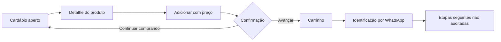
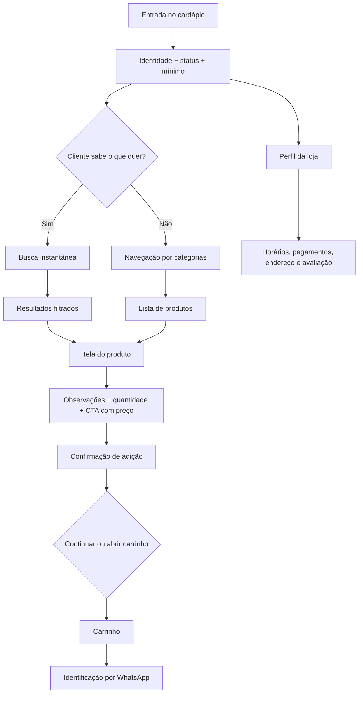

# Referência de UI, UX e conversão — cardápio Tremeliko's Burguer

> Auditoria visual e comportamental da página <https://pedido.anota.ai/loja/tremelikos-burguer-2>.  
> Data da captura: 2 de setembro de 2026.  
> Viewports observados: 390 × 844 px e 1280 × 720 px.  
> Estados da operação auditados: **loja fechada** e, em uma segunda inspeção no mesmo dia, **loja aberta até 23h**.

## 1. Objetivo deste documento

Este documento transforma o cardápio atual em uma especificação reproduzível de interface e experiência. A intenção é:

- preservar os padrões já familiares aos clientes;
- importar a simplicidade e a eficiência operacional da experiência atual;
- registrar medidas, cores, tipografia, hierarquia e comportamentos observados;
- identificar o que não deve ser copiado;
- acrescentar mecanismos que estimulem a descoberta, a montagem do pedido e o aumento do ticket médio;
- orientar a implementação já existente no repositório da Tremeliko's.

“Importar o design” deve significar **reconstruir os padrões de interação e hierarquia com identidade própria**, não copiar código-fonte, marcas, ícones proprietários ou ativos visuais do Anota AI. Fotos, logotipo, ilustrações e componentes finais devem pertencer à Tremeliko's.

## 2. Conclusão executiva

O cardápio de referência é uma boa base porque é direto, previsível e leve. Ele reduz distrações e apresenta os produtos em uma lista facilmente reconhecível. Os padrões mais importantes para preservar são:

1. cabeçalho com identidade e estado da loja;
2. status operacional impossível de ignorar;
3. busca que filtra imediatamente;
4. navegação horizontal por categorias;
5. produto em card compacto, com imagem à direita;
6. uma coluna no celular e duas no desktop;
7. tela de produto simples com CTA fixo quando a loja está aberta;
8. navegação/ação persistente na parte inferior;
9. perfil separado para informações de confiança.

Porém, “estar validado” como cardápio em operação não prova que todas as decisões são ótimas para tráfego pago. A referência tem limitações importantes:

- 37 dos 39 produtos utilizam a mesma imagem genérica;
- os cards não têm CTA explícito como “Adicionar”, embora a tela aberta do produto tenha um CTA fixo claro;
- não existe seção prioritária de ofertas, combos ou mais vendidos;
- o cardápio começa por entradas, e não pelo produto principal;
- a proposta “Hambúrguer na brasa, sabor de verdade” fica escondida no perfil;
- a loja fechada leva a uma tela de produto sem ação de compra, enquanto a loja aberta habilita corretamente o fluxo de carrinho;
- não há prova social visível perto da decisão;
- o produto de R$ 14,99 fica R$ 0,01 abaixo do pedido mínimo de R$ 15,00;
- botões de busca, compartilhamento e retorno não possuem nomes acessíveis adequados em alguns estados.

### Direção recomendada

Adotar uma abordagem híbrida:

- **preservar:** estrutura, densidade, busca, categorias, cards, responsividade e status;
- **melhorar:** fotos, CTA, carrinho, ofertas, confiança, prova social, upsell e estado de loja fechada;
- **não copiar:** ausência de ação, imagens genéricas, duplicação de categorias, limitações de acessibilidade e navegação sem orientação comercial.

### Validação adicional com a loja aberta

A segunda inspeção confirmou que o fluxo de compra é funcional e mais competente do que era possível observar no estado fechado:



Foram confirmados os seguintes padrões:

- status discreto `Aberto até 23h` e pedido mínimo de R$ 15,00;
- CTA fixo `Adicionar • R$ 16,99` no detalhe do produto;
- confirmação visual depois da adição;
- escolha explícita entre continuar comprando e ir ao carrinho;
- carrinho com edição de quantidade, limpeza protegida por confirmação e CTA fixo;
- identificação progressiva: WhatsApp primeiro, nome habilitado depois;
- mensagem de confiança informando que o ambiente é protegido.

A inspeção foi interrompida antes de qualquer identificação ou envio de pedido. O item de teste foi removido e a aba foi devolvida ao cardápio vazio.

## 3. Anatomia da página de referência

### Fluxo visual da página inicial

```text
┌─────────────────────────────────────┐
│ Capa da marca                       │
├─────────────────────────────────────┤
│ Logo  Nome              Busca Share │
├─────────────────────────────────────┤
│ Status aberto/fechado               │
├─────────────────────────────────────┤
│ Pedido mínimo        Perfil da loja │
├─────────────────────────────────────┤
│ Busca expandida, quando acionada    │
├─────────────────────────────────────┤
│ Categorias em rolagem horizontal    │
├─────────────────────────────────────┤
│ Título da seção                     │
│ ┌─────────────────────────────────┐ │
│ │ Nome + descrição + preço  Foto │ │
│ └─────────────────────────────────┘ │
│ ┌─────────────────────────────────┐ │
│ │ Nome + descrição + preço  Foto │ │
│ └─────────────────────────────────┘ │
│ ...                                 │
├─────────────────────────────────────┤
│ Início                       Pedidos │
└─────────────────────────────────────┘
```

### Fluxo comportamental observado



## 4. Design system observado

### Tipografia

A página utiliza **Montserrat, sans-serif** em todos os elementos observados.

| Uso | Tamanho | Peso | Altura de linha | Cor observada |
|---|---:|---:|---:|---|
| Nome da loja | 16 px | 700 | 18 px | `#2B2B2B` |
| Título de seção | 18 px | 700 | 16 px | `#333333` |
| Nome do produto no card | 14 px | 600 | 16 px | `#5A5A5A` |
| Descrição no card | 12 px | 400 | 16 px | `#595959` |
| Preço no card | 16 px | 700 | 16 px | `#5A5A5A` |
| Status da loja | 11 px | 600 | normal | `#FFFFFF` |
| Link “Perfil da loja” | 11 px | 700 | normal | `#CC5902` |
| Nome na tela do produto | 22 px | 700 | normal | `#000000` |
| Título de bloco no perfil | 15 px | 700 | normal | `#333333` |
| Texto de horário | 12 px | 400 | 18 px | tons de cinza |
| Tagline no perfil | 10 px | 400 | normal | `#2B2B2B` |

### Paleta observada

| Token sugerido | Valor | Uso na referência |
|---|---|---|
| `--surface` | `#FFFFFF` | Fundo principal e cards. |
| `--text-strong` | `#2B2B2B` | Marca e textos de alta hierarquia. |
| `--text-section` | `#333333` | Títulos de seção. |
| `--text-muted` | `#5A5A5A` | Produto, descrição e preço. |
| `--border-subtle` | `#EBEBEB` | Cards e divisores. |
| `--field-border` | `#E1E1E1` | Textarea e campos. |
| `--field-background` | `#EBEBEB` | Busca expandida. |
| `--brand-active` | `#CC5902` | Link ativo e detalhes laranja. |
| `--brand-soft` | `#FFF3D3` | Fundo dos botões circulares. |
| `--status-closed` | `#AE2929` | Faixa de loja fechada. |
| `--shadow-color` | `rgba(10,10,10,.10)` | Navegação e rodapé fixo. |

A aplicação atual do projeto já possui tokens próximos em [app/globals.css](D:/Projetos/tremelikos/app/globals.css), inclusive `#CC5902` e `#FFF3D3`. Eles podem ser mantidos. O laranja principal `#F47500` do projeto é mais forte do que o laranja da referência e funciona melhor para CTA.

### Formas e profundidade

- borda arredondada da capa no desktop: 16 px somente nos cantos inferiores;
- card desktop: raio de 8 px;
- foto no card: raio de 4 px;
- campo de busca: raio de 8 px;
- textarea: raio de 4 px;
- botões circulares do cabeçalho: 24 × 24 px, raio de 50%;
- navegação inferior: fundo branco e sombra superior ampla `0 -15px 45px rgba(10,10,10,.10)`;
- cards praticamente sem sombra; a separação é feita por borda e espaço;
- a interface evita gradientes, ornamentos e elevação excessiva.

### Espaçamento-base

O sistema usa múltiplos recorrentes de 4 e 8 px:

- margem lateral mobile: 16 px;
- espaçamento entre elementos internos: 4, 8 ou 10 px;
- gap entre cards no desktop: 16 px;
- padding do card desktop: 8 px horizontal;
- padding de seção: 16 px nas laterais, 16 px no topo e 24 px na base;
- navegação horizontal: 8 px de padding lateral;
- observação do produto: 16 px de margem lateral.

## 5. Layout responsivo observado

### Desktop — 1280 × 720 px

- conteúdo central com largura de 1080 px;
- margens laterais aproximadas de 93 px;
- capa de 1080 × 273 px;
- capa com proporção aproximada de 4:1;
- faixa de status com 1048 × 45 px, recuada 16 px dentro do container;
- área de produtos em grid de duas colunas;
- cada coluna tem aproximadamente 516 px;
- gap horizontal e vertical de 16 px;
- card com aproximadamente 516 × 108 px;
- foto do produto com 90 × 90 px;
- navegação inferior com 60 px de altura.

### Mobile — 390 × 844 px

- largura útil observada: 375 px por causa da área visual segura do navegador;
- capa com aproximadamente 375 × 110 px;
- conteúdo com margem lateral de 16 px;
- grid substituído por lista de uma coluna;
- produto com aproximadamente 343 × 110 px;
- imagem continua com 90 × 90 px;
- título pode ocupar duas linhas de 16 px;
- cards mobile perdem a borda externa do desktop e usam separação mais discreta;
- barra de status usa largura total, inclusive ultrapassando o recuo do conteúdo;
- navegação inferior fixa com 60 px;
- busca expandida ocupa 343 × 30 px;
- categorias formam trilho horizontal rolável com altura de 30 px.

O breakpoint exato do Anota AI não foi inferido. Para o novo projeto, recomenda-se transição para duas colunas a partir de 768 px, validando a densidade real com as fotos definitivas.

### Fluxo transacional desktop — loja aberta

| Tela/componente | Medida observada | Observação |
|---|---:|---|
| Conteúdo do detalhe | 768 px | Centralizado e com muito espaço lateral |
| Textarea de observações | 736 × 96 px | Campo amplo, opcional |
| CTA fixo de adicionar | 598 × 50 px | Divide a barra com stepper de quantidade |
| Botões do stepper no detalhe | 24 × 24 px | Abaixo do alvo mínimo recomendado |
| Modal de sucesso | aproximadamente 400 px | Confirmação central sobre overlay |
| Botões do modal | 368 × 40 px | Precisam crescer para 44 px |
| Conteúdo do carrinho | 768 px | Lista compacta e CTA inferior fixo |
| Campo de identificação | 368 × 53 px | Bom tamanho para toque |
| CTA de identificação | 368 × 50 px | Desabilitado até validação inicial |

O detalhe e o carrinho são páginas dedicadas, não drawers no desktop. Isso favorece foco, mas perde contexto do catálogo e deixa grandes áreas vazias. Para o novo projeto, um modal/drawer desktop pode reduzir ruptura, desde que URL, histórico, acessibilidade e retorno de foco sejam tratados corretamente.

## 6. Componentes e comportamentos

### 6.1 Capa

**Referência:** imagem larga, monocromática, com logotipo centralizado. No desktop, a capa domina a primeira dobra; no celular ela fica compacta.

**Importar:**

- imagem real da marca ou hambúrguer assinatura;
- corte responsivo com `object-fit: cover`;
- área reduzida no celular;
- cantos inferiores arredondados somente no desktop.

**Melhorar:**

- a capa deve vender o produto, não apenas repetir o logotipo;
- usar foto do hambúrguer mais desejável com logo discreto;
- manter texto e CTA fora da imagem para acessibilidade e flexibilidade.

### 6.2 Cabeçalho da loja

**Referência:** logo circular sobreposto à base da capa, nome à direita, busca e compartilhamento no extremo direito.

**Importar:**

- logo + nome em um bloco curto;
- ações secundárias compactas;
- cabeçalho com baixa altura para não consumir a tela mobile.

**Melhorar:**

- botões devem ter alvo de toque mínimo de 44 × 44 px;
- adicionar `aria-label` a busca e compartilhamento;
- substituir o simples compartilhamento por Web Share API com fallback;
- tornar o cabeçalho compacto e sticky depois que a capa sair da tela.

### 6.3 Status da operação

**Referência:** faixa vermelha de 45 px com texto branco “Loja fechada, abre hoje às 18h30”. A informação é direta e visualmente dominante.

**Importar:**

- estado sempre visível no topo;
- próxima abertura expressa em linguagem natural;
- pedido mínimo logo abaixo.

**Estado aberto confirmado:** no desktop, a plataforma substitui a faixa de alerta por uma linha muito mais discreta: `Aberto até 23h • Pedido mín. R$ 15,00`. Isso reduz ruído quando está tudo normal, mas o estado aberto pode passar despercebido para quem chega com pressa.

**Melhorar:**

- aberto: usar verde moderado e mostrar estimativa de preparo/entrega, se confiável;
- fechando em breve: âmbar;
- fechado: vermelho somente para o status, não para CTAs;
- permitir “Montar pedido para mais tarde” se a operação aceitar agendamento;
- explicar se o cliente ainda pode navegar, montar carrinho ou enviar pré-pedido.

### 6.4 Busca

**Referência:** começa como ícone; ao ser acionada, vira um campo cinza de 343 × 30 px com placeholder “O que você quer comprar hoje?”. A filtragem é instantânea e pesquisa nome/descrição. Ao pesquisar “picanha”, a lista foi reduzida imediatamente aos quatro produtos relacionados.

**Importar:**

- pesquisa instantânea sem botão “Buscar”;
- busca por nome e ingredientes;
- retorno direto de produtos, sem página intermediária;
- placeholder orientado à intenção.

**Melhorar:**

- manter 44 px de altura no novo projeto;
- incluir botão limpar;
- mostrar quantidade de resultados;
- tratar zero resultados com sugestões e categorias;
- aceitar pequenas variações de grafia e acentos;
- registrar `search` e `view_search_results` para descobrir demanda.

### 6.5 Navegação por categorias

**Referência inicial/mobile:** lista horizontal rolável, sem quebra de linha, com item ativo indicado por linha/estado laranja.

**Estado aberto no desktop:** depois que o cabeçalho sai da tela, aparece uma barra sticky de largura total com a categoria corrente e uma seta. Ao abrir, ela lista todas as seções. O controle é implementado como `div`, sem semântica de botão ou `combobox`. Durante a inspeção, o rótulo ativo também ficou temporariamente fora de sincronia com a seção visível — por exemplo, a viewport mostrava `Linha Tradicional` enquanto a barra indicava outra categoria.

**Importar:**

- navegação sticky por categorias;
- scroll suave até a seção;
- atualização confiável do item ativo conforme a rolagem;
- uma única linha, sem ocupar altura excessiva.

**Melhorar:**

- usar pills com área de toque de pelo menos 40–44 px;
- inserir primeiro `Ofertas`, `Mais pedidos` e `Combos`;
- unificar as duas ocorrências de `Linha Gourmet`;
- manter o item ativo visível automaticamente;
- incluir gradiente lateral sutil para indicar que há mais categorias.
- no desktop, usar `button` + popover/listbox ou `select` acessível; nunca uma `div` clicável sem nome ou estado expandido;
- calcular o item ativo com `IntersectionObserver`, considerando a altura do cabeçalho sticky;

### 6.6 Card de produto

**Referência desktop:** card de 516 × 108 px, borda `#EBEBEB`, raio 8 px, conteúdo em flex e foto de 90 × 90 px à direita.

**Referência mobile:** bloco de 343 × 110 px, uma coluna, foto de 90 × 90 px à direita, separação discreta.

**Hierarquia interna:**

1. nome, 14/600;
2. descrição, 12/400 e no máximo duas linhas visuais;
3. preço, 16/700;
4. foto à direita.

**Importar:**

- densidade compacta;
- imagem sempre em posição previsível;
- nome, descrição e preço alinhados à esquerda;
- card inteiro clicável.

**Melhorar obrigatoriamente:**

- adicionar CTA explícito `Adicionar` ou botão `+` com nome acessível;
- trocar todas as imagens genéricas por fotos reais;
- mostrar badge comercial somente quando verdadeiro;
- mostrar preço promocional e economia quando houver;
- manter o CTA acima da dobra do card;
- não truncar o nome a ponto de esconder a diferença entre produtos;
- comunicar “indisponível hoje” sem retirar o produto abruptamente.

### 6.7 Tela do produto

**Observado:**

- cabeçalho com voltar e compartilhar;
- título 22/700;
- preço logo abaixo;
- descrição em texto corrido;
- bloco cinza `Observações`;
- textarea de 358 × 96 px no mobile;
- rodapé fixo de 47 px;
- com a loja fechada, o rodapé mostra somente o status e não há CTA de adicionar;
- no produto analisado, a imagem não apareceu na tela de detalhe.

**Com a loja aberta:**

- o rodapé passa a ter seletor de quantidade e CTA laranja de 50 px;
- o CTA combina ação e preço: `Adicionar • R$ 16,99`;
- o botão de reduzir fica desabilitado na quantidade 1;
- o CTA ocupa aproximadamente 598 px no desktop, dentro do conteúdo de 768 px;
- após adicionar, surge um modal central com ilustração de sucesso, nome do produto, quantidade, observações e duas escolhas;
- `Avançar para o carrinho` é a ação primária e `Continuar comprando` a secundária;
- o modal repete quantidade e observações já oferecidas na tela do produto, criando alguma redundância.

**Importar:**

- decisão em uma única tela;
- hierarquia título → preço → descrição → personalização → ação;
- CTA/estado fixo no rodapé;
- observações opcionais.

**Melhorar obrigatoriamente:**

- exibir foto real grande;
- incluir quantidade;
- suportar adicionais e escolhas obrigatórias;
- atualizar preço total em tempo real;
- CTA `Adicionar ao pedido • R$ X`;
- permitir montar carrinho com loja fechada, se operacionalmente possível;
- rotular botões de voltar/compartilhar;
- fechar modal com gesto, botão, Escape e clique externo sem perder acessibilidade.
- aproveitar a confirmação para sugerir um complemento relevante, sem bloquear `Continuar comprando`;
- evitar repetir o formulário inteiro na confirmação quando nenhuma correção for necessária;
- nomear os botões de quantidade como `Diminuir quantidade` e `Aumentar quantidade`.

### 6.8 Barra inferior

**Referência com a loja aberta:** 60 px, fixa, branca, com sombra superior e três destinos: `Início`, `Pedidos` e `Carrinho`. Nas telas de produto e carrinho, essa navegação é substituída por uma ação contextual fixa.

**Importar:**

- ação persistente próxima ao polegar;
- respeito a `safe-area-inset-bottom`;
- feedback visual do estado ativo.

**Melhorar:**

No novo cardápio, uma barra de carrinho contextual é mais útil do que manter permanentemente dois itens de navegação:

```text
2 itens                         Ver pedido • R$ 54,90
```

Quando o carrinho estiver vazio, a barra pode desaparecer. O componente atual [CartBar.tsx](D:/Projetos/tremelikos/components/storefront/CartBar.tsx) já segue essa direção e deve ser preservado.

### 6.9 Confirmação de adição

Depois de adicionar o produto, a plataforma não envia o cliente silenciosamente ao carrinho. Ela apresenta uma confirmação modal que resolve três dúvidas de uma vez:

- a ação deu certo;
- qual produto foi adicionado;
- qual é o próximo caminho possível.

O modal observado tinha aproximadamente 400 px de largura no desktop. Os botões `Avançar para o carrinho` e `Continuar comprando` ocupavam toda a largura interna, com 40 px de altura.

**Importar:**

- feedback explícito de sucesso;
- produto nomeado na mensagem;
- rotas para continuar explorando ou revisar o pedido;
- fundo escurecido para concentrar atenção.

**Melhorar:**

- controles com pelo menos 44 px de altura;
- ilustração e texto com contraste adequado;
- foco inicial no título ou ação primária e foco preso no modal;
- sugestão contextual curta, por exemplo `Que tal uma Coca-Cola lata?`, baseada no produto adicionado;
- não transformar o upsell em etapa obrigatória;
- anunciar a confirmação por região `aria-live`.

### 6.10 Carrinho

O carrinho aberto usa conteúdo central de aproximadamente 768 px e mantém grande quantidade de espaço em branco. A composição é direta:

1. cabeçalho `Carrinho` com ação `Limpar`;
2. item com miniatura, quantidade, nome e preço;
3. stepper para alterar quantidade;
4. botão contornado `Adicionar mais produtos`;
5. CTA fixo `Avançar • R$ 16,99`.

Ao limpar, a plataforma pede confirmação com a pergunta `Deseja esvaziar seu carrinho?`. A opção segura `Não` recebe o preenchimento laranja, enquanto `Sim, limpar` fica contornada. É uma boa prevenção de erro, embora a cor primária na negativa possa parecer inconsistente com outros fluxos.

**Importar:**

- edição sem voltar ao produto;
- preço persistente no CTA;
- ação para continuar comprando;
- confirmação antes de limpar tudo;
- estado vazio com explicação e botão `Ver cardápio`.

**Melhorar:**

- trocar o CTA genérico `Avançar` por `Continuar pedido` ou `Informar entrega`;
- mostrar subtotal com rótulo, pedido mínimo e o que ainda falta;
- informar que entrega/taxa serão calculadas depois, quando for o caso;
- usar fotos reais no resumo;
- oferecer edição de observação e adicionais por item;
- apresentar upsell de bebida/batata antes do CTA, no máximo 2–3 sugestões;
- incluir indicador curto do fluxo: `Carrinho → Entrega → Pagamento → Confirmar`;
- garantir que `Limpar` não seja o elemento mais saliente do cabeçalho.

### 6.11 Identificação

Depois do carrinho, a plataforma abre uma página isolada `Identifique-se`:

- telefone/WhatsApp com foco automático e teclado `tel`;
- campo de nome inicialmente desabilitado;
- botão `Avançar` em estado visualmente desabilitado;
- mensagem: `Para realizar seu pedido vamos precisar de suas informações, este é um ambiente protegido.`

O formulário tem largura aproximada de 368 px no desktop. Os inputs medem 53 px de altura e o CTA 50 px, bons tamanhos para toque. A liberação sequencial do nome reduz a carga inicial e provavelmente permite reconhecer clientes recorrentes pelo número.

**Importar:**

- identificação progressiva;
- foco no primeiro campo;
- tipo de teclado correto;
- explicação de confiança junto ao formulário;
- recuperação de cliente recorrente somente com base legal e tratamento seguro.

**Melhorar:**

- explicar por que o WhatsApp é necessário: confirmação e atualização do pedido;
- linkar política de privacidade/LGPD perto do CTA;
- informar o formato do número sem depender só da máscara;
- manter resumo e valor do pedido visíveis;
- mostrar progresso do checkout;
- não bloquear o nome apenas por lógica visual: comunicar o que falta e usar estados acessíveis;
- não enviar código ou criar cadastro até o usuário consentir e avançar;
- medir abandono entre carrinho e identificação.

### 6.12 Perfil da loja e sinais de confiança

**Referência observada:**

- topo próprio com retorno e título `Perfil da loja`;
- capa e bloco de marca;
- tagline “🔥 Hambúrguer na brasa, sabor de verdade”;
- status e pedido mínimo;
- bloco de horários;
- formas de pagamento com ícones;
- endereço e mapa;
- CTA de avaliação.

Os títulos de bloco usam fundo cinza claro, 15/700 e padding lateral de 16 px. As linhas de horários são simples, com divisores e boa leitura.

**Importar:**

- informações operacionais separadas do fluxo principal;
- mapa e endereço acionável;
- pagamentos visíveis;
- avaliação pós-compra.

**Melhorar:**

- trazer para a página inicial os sinais que eliminam objeções: bairro, entrega/retirada, Pix/cartão e horário;
- colocar a tagline no hero, não escondida no perfil;
- adicionar nota e contagem de avaliações apenas com dados reais;
- deixar políticas extensas no perfil/rodapé, sem poluir a vitrine.

## 7. O que vale importar e o que não vale

| Padrão | Decisão | Motivo |
|---|---|---|
| Montserrat | Importar | Mantém a personalidade visual da referência e boa leitura. |
| Container central | Importar | Dá previsibilidade no desktop. |
| Uma coluna mobile / duas desktop | Importar | Boa densidade e leitura. |
| Cards compactos | Importar | Facilita comparação rápida. |
| Foto à direita | Importar | Mantém escaneabilidade dos nomes e preços. |
| Busca instantânea | Importar | Reduz tempo para quem já sabe o que quer. |
| Categorias sticky | Importar com melhoria | Pills no mobile; seletor acessível no desktop; sincronização correta. |
| Status forte | Importar | Evita frustração operacional. |
| Perfil separado | Importar | Preserva foco comercial na vitrine. |
| Botões de 24 px | Não importar | Pequenos demais para toque e acessibilidade. |
| Card sem CTA | Não importar | O CTA existe apenas depois de abrir o produto; o primeiro passo continua implícito. |
| 37 imagens genéricas | Não importar | Derruba desejo, diferenciação e confiança. |
| Loja fechada sem alternativa | Não importar | Cria beco sem saída para tráfego pago. |
| Entradas como primeira seção | Não importar | Prioriza complemento antes do produto principal. |
| Duas seções Gourmet | Não importar | Duplica navegação e gera desorganização. |
| Navegação inferior com três destinos | Adaptar | Priorizar carrinho contextual com quantidade/valor. |
| Confirmação após adicionar | Importar com melhoria | Feedback e bifurcação são bons; reduzir redundância e testar upsell. |
| CTA do carrinho `Avançar` | Não copiar literalmente | O destino da ação não fica explícito. |
| Identificação progressiva | Importar com melhoria | Reduz carga, mas precisa de contexto, privacidade e progresso. |

## 8. Arquitetura da experiência de alta conversão

### Primeira dobra mobile recomendada

```text
┌─────────────────────────────────────┐
│ Logo  Tremeliko's    Buscar  Carrinho│
├─────────────────────────────────────┤
│ FOTO DO BURGER ASSINATURA           │
│ Hambúrguer na brasa, sabor de verdade│
│ Aberto • entrega e retirada         │
├─────────────────────────────────────┤
│ 🔥 Oferta de hoje / combo principal │
├─────────────────────────────────────┤
│ Buscar por lanche ou ingrediente    │
├─────────────────────────────────────┤
│ Ofertas | Mais pedidos | Combos ... │
└─────────────────────────────────────┘
```

### Ordem comercial das seções

1. Ofertas de hoje.
2. Mais pedidos.
3. Combos.
4. Gourmet 180 g.
5. Tradicionais 100 g.
6. Picanha na brasa.
7. Frango.
8. Pão de alho.
9. Porções.
10. Bebidas.
11. Sucos.

### Gatilhos comportamentais éticos

Usar somente quando verdadeiros e verificáveis:

- **redução de escolha:** destaque de 4 a 6 mais pedidos;
- **ancoragem:** preço separado versus preço do combo;
- **prova social:** `Mais pedido` baseado em vendas reais;
- **especificidade:** `180 g`, `na brasa`, `baguete de 23 cm`;
- **economia clara:** `Economize R$ 6,00`;
- **urgência real:** promoção com data/horário verdadeiro;
- **progresso:** `Faltam R$ 0,01 para o pedido mínimo` — embora o ideal seja corrigir o preço/mínimo;
- **reciprocidade:** molho da casa ou benefício real em combo;
- **compromisso progressivo:** adicionar rápido, personalizar depois quando necessário;
- **aversão a perda sem manipulação:** `Oferta até 23h` somente se programada e real.

Não usar estoque falso, cronômetro reiniciado, avaliações inventadas, preços anteriores fictícios ou mensagens de “X pessoas comprando agora” sem fonte confiável.

## 9. Auditoria CRO

### 9.1 Clareza da proposta de valor — severidade alta

A página informa o nome da loja, mas não apresenta na primeira dobra o diferencial. A frase `Hambúrguer na brasa, sabor de verdade` só aparece no perfil.

**Direção:** posicionamento e benefício devem estar no hero para que visitantes frios vindos de anúncios entendam a proposta em até cinco segundos.

### 9.2 Headline — severidade alta

Não existe uma headline comercial explícita na página inicial. O banner repete a marca.

**Direção:** usar uma frase concreta combinando produto, método e localidade.

### 9.3 CTA — severidade alta

Os cards são clicáveis, mas não informam claramente a ação. Com a loja aberta, o detalhe corrige isso com um excelente CTA fixo que combina ação e preço. O carrinho volta a usar o rótulo genérico `Avançar`, e no estado fechado a tela do produto continua sem próximo passo.

**Direção:** `Adicionar` no card, preservar `Adicionar ao pedido • R$ X` na tela e substituir `Avançar` por um texto que antecipe a próxima etapa. Quando fechado, usar `Montar pedido para as 18h30` ou `Ver cardápio e salvar pedido`, conforme a operação.

### 9.4 Hierarquia e escaneabilidade — severidade média

A densidade visual é boa, mas a ordem das categorias não orienta a venda. Entradas aparecem antes dos hambúrgueres.

**Direção:** destacar ofertas, best-sellers e combos antes da lista completa.

### 9.5 Confiança — severidade alta

Horários, pagamentos e endereço existem, mas ficam em outra tela. Não há nota ou avaliação visível na vitrine.

**Direção:** mostrar os sinais essenciais próximos ao hero e ao carrinho, mantendo detalhes no perfil.

### 9.6 Objeções — severidade média

Não ficam claros taxa de entrega, retirada, tempo estimado, área atendida ou o que acontece após clicar em pedir.

**Direção:** explicar o fluxo em uma linha e deixar custos que dependem do endereço explicitamente sinalizados.

### 9.7 Fricção — severidade alta

Fotos genéricas, card sem CTA, busca pequena, produto abaixo do pedido mínimo e loja fechada sem alternativa criam fricção evitável.

### 9.8 Carrinho e identificação — severidade média

O carrinho é limpo e editável, mas não apresenta progresso, taxa/estimativa nem explica o destino de `Avançar`. A identificação tem bons tamanhos de campo e revelação progressiva, porém remove o resumo do pedido e oferece uma afirmação genérica de segurança sem link de privacidade.

**Direção:** manter total e contexto visíveis, explicitar a próxima etapa e justificar o uso do WhatsApp em linguagem simples.

## 10. Quick wins — implementar agora

1. **Trocar as imagens dos 10 mais vendidos por fotos reais.** É o maior ganho imediato de desejo e diferenciação.
2. **Adicionar CTA explícito nos cards.** `Adicionar` para produto simples e `Escolher opções` para produto configurável.
3. **Colocar `Ofertas`, `Mais pedidos` e `Combos` antes de Entradas.** Reduz indecisão e aumenta ticket.
4. **Levar a tagline e informações essenciais para a primeira dobra.** Melhora clareza para tráfego frio.
5. **Corrigir o conflito R$ 14,99 × pedido mínimo R$ 15,00.** Ajustar preço ou mínimo elimina uma frustração artificial.

## 11. Mudanças de alto impacto

| Mudança | Racional | Esforço | Métrica principal |
|---|---|---:|---|
| Fotos reais em todo o catálogo | Comida é comprada visualmente; placeholder torna produtos indistinguíveis. | Médio | `add_to_cart / view_item` |
| Hero comercial com oferta coerente com o anúncio | Melhora message match e entendimento em cinco segundos. | Médio | taxa de interação e `add_to_cart / session` |
| Carrinho fixo com valor e quantidade | Mantém o próximo passo visível e reduz abandono. | Baixo, já implementado | `begin_checkout / add_to_cart` |
| Combos configurados como produtos | Facilita decisão e aumenta valor médio. | Médio | ticket médio e itens por pedido |
| Upsell contextual de bebida/batata | Captura complemento no momento de maior intenção. | Médio | attach rate e ticket médio |
| Pré-pedido/agendamento quando fechado | Evita desperdiçar tráfego pago fora do horário. | Alto, depende da operação | `whatsapp_order / closed_session` |
| Prova social real | Reduz risco percebido e acelera escolha. | Médio | `add_to_cart / view_item` |
| Landing states por campanha | Mantém promessa do anúncio e oferta consistente. | Médio | conversão por campanha |
| Checkout com progresso e total persistente | Reduz incerteza entre carrinho e identificação. | Médio | conclusão por início de checkout |
| Confirmação de adição com upsell opcional | Usa o momento de intenção sem bloquear a jornada. | Médio | attach rate e continuidade ao carrinho |

## 12. Alternativas de copy

### Headline do hero

| Variante | Texto | Quando usar |
|---|---|---|
| A | **Hambúrguer na brasa, sabor de verdade.** | Melhor continuidade com o posicionamento atual. |
| B | **Seu hambúrguer artesanal na brasa em Jequié.** | Melhor para Google Ads e visitantes com intenção local. |
| C | **Carne na brasa, ingredientes de verdade e entrega em Jequié.** | Melhor quando delivery for parte central da promessa. |

### Subheadline

| Variante | Texto | Racional |
|---|---|---|
| A | Escolha seu lanche, monte o pedido e finalize pelo WhatsApp. | Explica o fluxo sem surpresa. |
| B | Dos tradicionais aos gourmets de 180 g — peça para entregar ou retirar. | Mostra variedade e especificidade. |
| C | Feito na hora, com opções para todos os tamanhos de fome. | Mais emocional; testar após o básico estar claro. |

### CTA do produto

| Contexto | CTA recomendado |
|---|---|
| Produto simples | `Adicionar` |
| Produto com adicionais obrigatórios | `Escolher opções` |
| Modal/tela do produto | `Adicionar ao pedido • R$ 29,90` |
| Carrinho | `Revisar e enviar pedido` |
| Saída do carrinho | `Informar entrega` ou `Continuar pedido` |
| Finalização | `Enviar pedido pelo WhatsApp` |

### Loja fechada

| Variante | Texto | Condição |
|---|---|---|
| A | **Fechado agora. Abrimos hoje às 18h30.** Você pode montar seu pedido. | Se o carrinho puder ser montado. |
| B | **Abrimos às 18h30.** Monte agora e envie quando estivermos abertos. | Se o envio ficar bloqueado. |
| C | **Agende para hoje a partir das 18h30.** | Somente se a operação aceitar agendamento real. |

## 13. Hipóteses de teste A/B

Correções óbvias — fotos, acessibilidade e CTA explícito — devem ser implementadas sem teste. Testar apenas escolhas em que ambas as variantes sejam plausíveis.

| Prioridade | Hipótese | Controle | Variante | Métrica |
|---:|---|---|---|---|
| 1 | Um hero com combo específico converte mais do que posicionamento genérico. | Tagline institucional | Foto + combo + economia | `add_to_cart / session` |
| 2 | `Mais pedidos` reduz indecisão de tráfego frio. | Catálogo começando em Entradas | 6 best-sellers primeiro | tempo até primeiro add e conversão |
| 3 | CTA com preço reduz incerteza. | `Adicionar` | `Adicionar • R$ X` | `add_to_cart / product_view` |
| 4 | Pill `Mais pedido` baseada em vendas melhora escolha. | Sem badge | Badge nos três campeões | conversão dos itens sinalizados |
| 5 | Upsell no modal aumenta ticket sem reduzir checkout. | Sem sugestão | `Complete com batata + bebida` | ticket e `begin_checkout` |
| 6 | Permitir montar pedido fechado recupera mídia fora do horário. | Navegação sem ação | Carrinho disponível | leads por sessão fechada |
| 7 | Mostrar nota real perto do hero aumenta confiança. | Nota só no perfil | Nota + contagem no topo | conversão da sessão |
| 8 | Um complemento relevante na confirmação aumenta ticket sem atrapalhar o fluxo. | Confirmação simples | Uma bebida ou batata sugerida | attach rate e abandono do modal |
| 9 | CTA que antecipa a próxima etapa reduz hesitação. | `Avançar` | `Informar entrega` | avanço para identificação |

Todo experimento precisa preservar origem da campanha e usar `event_id`, produto, valor e estado aberto/fechado.

## 14. Aplicação no código atual do projeto

O repositório já implementa várias melhorias sobre a referência. A estratégia correta é ajustar o que existe, não recomeçar.

### O que já está bem encaminhado

- [ProductCard.tsx](D:/Projetos/tremelikos/components/storefront/ProductCard.tsx) já tem CTA `Adicionar` e card inteiro clicável.
- [ProductModal.tsx](D:/Projetos/tremelikos/components/storefront/ProductModal.tsx) já possui quantidade, observações e CTA com preço.
- [CartBar.tsx](D:/Projetos/tremelikos/components/storefront/CartBar.tsx) já mantém quantidade, subtotal e próximo passo visíveis.
- [CategoryNav.tsx](D:/Projetos/tremelikos/components/storefront/CategoryNav.tsx) já implementa categorias sticky e horizontais.
- [page.tsx](<D:/Projetos/tremelikos/app/(storefront)/page.tsx>) já prevê destaques, hero e informações da loja.
- Os tokens de marca existentes já incluem `#CC5902` e `#FFF3D3`, próximos da referência.

### Ajustes recomendados por arquivo

#### `app/layout.tsx`

- carregar Montserrat via `next/font/google` ou decidir explicitamente por outra fonte;
- hoje o Tailwind referencia `--font-inter`, mas a variável não é carregada no layout;
- definir a variável de fonte no `<body>` e evitar fallback acidental.

#### `app/globals.css` e `tailwind.config.ts`

- manter o laranja forte `#F47500` como CTA;
- manter `#CC5902` para estado ativo/texto;
- adicionar tokens de status aberto/fechado, bordas e superfícies;
- trocar `.container-store` de `max-w-4xl` para até 1080 px no desktop, se o objetivo for aproximar a referência;
- preservar margem lateral de 16 px no celular;
- usar `prefers-reduced-motion` em transições e scroll suave.

#### `components/storefront/Header.tsx`

- substituir o placeholder `T` pelo logotipo real;
- manter header compacto e sticky;
- adicionar busca acessível;
- considerar compactação após a rolagem da capa;
- status não deve depender somente de cor.

#### `app/(storefront)/page.tsx`

- substituir gradiente genérico por foto de capa ou composição fotográfica da marca;
- manter headline e subheadline sobre fundo de bom contraste;
- inserir `Ofertas`, `Mais pedidos` e `Combos` antes das seções normais;
- usar grid `md:grid-cols-2` para aproximar a densidade desktop da referência;
- manter uma coluna no celular;
- remover emojis como imagem final dos produtos.

#### `components/storefront/ProductCard.tsx`

- integrar `next/image` e `product_images`;
- usar foto 90–96 px no celular e desktop;
- escolher CTA por tipo de produto: simples versus configurável;
- trocar `truncate` do nome por `line-clamp-2` quando necessário;
- mostrar promoção, preço anterior e economia;
- garantir botão mínimo de 44 px.

#### `components/storefront/CategoryNav.tsx`

- adicionar estado ativo por `IntersectionObserver`;
- rolar o item ativo para a área visível;
- colocar categorias comerciais primeiro;
- adicionar gradiente de overflow nas laterais.

#### `components/storefront/ProductModal.tsx`

- integrar foto real;
- suportar adicionais e escolhas obrigatórias;
- bloquear o CTA até escolhas obrigatórias serem concluídas;
- mostrar o preço total atualizado;
- adicionar nomes acessíveis aos botões `-` e `+`;
- aplicar focus trap, retorno de foco e fechamento com Escape;
- definir comportamento de loja fechada.
- depois da adição, confirmar o sucesso e oferecer `Continuar comprando` ou `Revisar pedido`;
- testar um único upsell relevante nessa confirmação;
- não repetir quantidade e observações se elas já estiverem confirmadas.

#### `components/storefront/CartBar.tsx`

- preservar o componente;
- garantir que não conflite com banner de cookies;
- respeitar safe area;
- no pedido mínimo, mostrar progresso sem usar alerta excessivo;
- medir clique em `Ver pedido`.

#### Carrinho e checkout

- usar CTA que revele a próxima etapa, não apenas `Avançar`;
- manter subtotal e pedido mínimo visíveis;
- implementar indicador de progresso curto;
- pedir WhatsApp somente quando necessário para concluir;
- explicar finalidade, privacidade e consentimento;
- manter os dados do pedido no contexto durante a identificação;
- proteger limpeza/remoção com confirmação e possibilidade de desfazer.

## 15. Especificação recomendada dos componentes

### Tokens finais

```css
:root {
  --brand: #f47500;
  --brand-hover: #ff930a;
  --brand-active: #cc5902;
  --brand-soft: #fff3d3;
  --text-strong: #2b2b2b;
  --text-section: #333333;
  --text-muted: #5a5a5a;
  --surface: #ffffff;
  --surface-muted: #f5f5f5;
  --border-subtle: #ebebeb;
  --status-open: #18794e;
  --status-warning: #a15c00;
  --status-closed: #ae2929;
  --radius-sm: 4px;
  --radius-md: 8px;
  --radius-lg: 12px;
  --space-page: 16px;
  --content-max: 1080px;
}
```

### Card alvo

```text
Mobile:  largura disponível × 110–124 px
Desktop: 2 colunas, aproximadamente 516 × 108–124 px
Foto:    90–96 px quadrada, object-fit cover
Título:  14 px / 600 / até 2 linhas
Texto:   12–14 px / 400 / até 2 linhas
Preço:   16–18 px / 700
CTA:     altura mínima 44 px
Raio:    8–12 px
```

### Estados obrigatórios

Cada componente de produto deve suportar:

- padrão;
- hover/focus desktop;
- pressionado mobile;
- promoção;
- indisponível;
- esgotado hoje;
- carregando/skeleton;
- erro de imagem;
- adicionando;
- adicionado com feedback;
- produto com opções obrigatórias.

## 16. Acessibilidade

- targets de toque de pelo menos 44 × 44 px;
- `aria-label` em busca, compartilhar, voltar, quantidade e carrinho;
- cards clicáveis precisam de semântica de botão/link ou ação interna explícita;
- ordem de foco equivalente à ordem visual;
- focus trap no modal;
- foco devolvido ao produto ao fechar;
- contraste AA;
- status com texto, não apenas cor;
- preço anterior anunciado corretamente, sem confundir leitor de tela;
- alt text descritivo para fotos reais;
- navegação de categorias operável por teclado;
- respeitar `prefers-reduced-motion`;
- não impedir zoom do usuário — a referência usa `maximum-scale=1` e `user-scalable=0`, o que **não deve ser copiado**.

## 17. Métricas de produto e conversão

Registrar no mínimo:

- `view_menu`;
- `search` com termo normalizado e contagem de resultados;
- `select_category`;
- `view_item`;
- `add_to_cart`;
- `add_to_cart_success`;
- `continue_shopping`;
- `remove_from_cart`;
- `view_cart`;
- `begin_checkout`;
- `identification_start` e `identification_complete`;
- `whatsapp_order`;
- `share`;
- `view_store_profile`;
- `store_closed_session`;
- `promotion_view` e `promotion_select`.

Segmentar relatórios por:

- dispositivo;
- campanha/UTM;
- estado aberto ou fechado;
- produto e categoria;
- primeira seção vista;
- busca usada ou não;
- cliente novo/recorrente quando houver base legítima;
- sessão com ou sem promoção.

### KPIs

- adição ao carrinho por sessão;
- adição por visualização de produto;
- início de checkout por carrinho;
- identificação concluída por início de checkout;
- pedido no WhatsApp por início de checkout;
- ticket médio estimado;
- itens por pedido;
- attach rate de bebida e batata;
- conversão durante loja fechada;
- receita/lead por campanha;
- tempo até primeira adição.

## 18. Checklist de aceite visual e comportamental

### Página inicial

- [ ] proposta entendida em cinco segundos;
- [ ] status e próxima abertura visíveis;
- [ ] busca acessível e instantânea;
- [ ] categorias sticky e roláveis;
- [ ] ofertas e best-sellers antes do catálogo completo;
- [ ] uma coluna mobile e duas desktop;
- [ ] nenhuma imagem genérica nos produtos prioritários;
- [ ] CTA explícito em todos os cards;
- [ ] carrinho contextual fixo;
- [ ] sem colisão entre carrinho, cookies e safe area.

### Produto

- [ ] foto, nome, descrição e preço claros;
- [ ] escolhas obrigatórias validadas;
- [ ] quantidade e observações;
- [ ] preço total em tempo real;
- [ ] CTA fixo e acessível;
- [ ] estado fechado com próximo passo;
- [ ] modal acessível por teclado e leitor de tela.
- [ ] confirmação oferece continuar comprando ou revisar pedido;
- [ ] upsell, quando existir, é opcional e mensurável.

### Carrinho e identificação

- [ ] item, quantidade, observações e preço são editáveis;
- [ ] subtotal e progresso do pedido mínimo permanecem visíveis;
- [ ] CTA informa qual é a próxima etapa;
- [ ] limpeza e exclusão possuem prevenção de erro;
- [ ] resumo do pedido permanece acessível durante a identificação;
- [ ] WhatsApp tem finalidade e privacidade explicadas;
- [ ] campos usam teclado, máscara e autocomplete adequados;
- [ ] abandono é mensurado por etapa sem coletar conteúdo sensível.

### Confiança

- [ ] endereço e bairro;
- [ ] entrega/retirada;
- [ ] horário;
- [ ] meios de pagamento;
- [ ] pedido mínimo;
- [ ] nota/avaliações apenas se reais;
- [ ] política de privacidade e cookies.

### Performance

- [ ] imagem LCP otimizada;
- [ ] imagens de card com dimensões reservadas;
- [ ] fontes sem mudança perceptível de layout;
- [ ] interface utilizável em 320 px;
- [ ] LCP abaixo de 2,5 s no percentil 75;
- [ ] INP abaixo de 200 ms;
- [ ] CLS abaixo de 0,1.

## 19. Limitações da captura

- A auditoria comparou a loja fechada e aberta no mesmo dia.
- Foram observados o CTA aberto, confirmação de adição, carrinho e início da identificação.
- O fluxo foi interrompido antes de informar telefone, nome, endereço, entrega, pagamento ou enviar o pedido.
- Não foram realizadas compras, envios ou alterações externas.
- Um produto foi temporariamente adicionado apenas para inspecionar o fluxo; o carrinho foi limpo e a aba devolvida ao cardápio.
- O breakpoint exato da plataforma não foi obtido; foram comparados os estados em 390 px e 1280 px.
- Medidas são valores computados no navegador e podem variar alguns pixels por scrollbar, safe area, zoom e sistema operacional.
- A análise de conversão é uma avaliação heurística. Resultados precisam ser confirmados com dados reais, funil e experimentos.

## 20. Recomendação final

O novo cardápio deve parecer familiar para quem já usa o Anota AI, mas comercialmente mais competente. A combinação recomendada é:

1. estrutura compacta e previsível da referência;
2. identidade própria da Tremeliko's;
3. fotos reais fortes;
4. headline clara;
5. ofertas, mais vendidos e combos primeiro;
6. CTA explícito;
7. produto configurável sem fricção;
8. carrinho fixo;
9. confiança perto da decisão;
10. rastreamento completo para Meta Ads e Google Ads.

O código atual já implementa boa parte da camada de conversão que falta na referência. O trabalho mais valioso agora não é clonar a interface pixel a pixel, e sim **alinhar tipografia, densidade, responsividade e padrões familiares, mantendo as melhorias de CTA, carrinho e ofertas já planejadas**.
